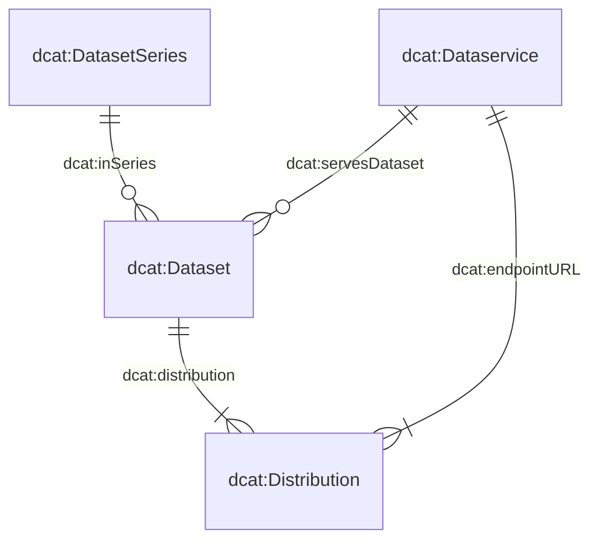

# Handbuch

Dieses Handbuch erklärt die wichtigsten Grundlagen des Datenkatalogs und unterstützt Sie dabei, Datenprodukte korrekt zu beschreiben und zu erfassen.

## Wie können Sie beitragen?

Der Datenkatalog lebt von **vollständigen, verständlichen und aktuellen Metadaten**.

Wenn Sie ein Datenprodukt kennen, das im Katalog fehlt, oder wenn Informationen zu einem bestehenden Eintrag ergänzt oder korrigiert werden müssen, können Sie uns unterstützen.

Auch Vorschläge zur Weiterentwicklung des Datenkatalogs oder des Erfassungsformulars sind willkommen:

- Eröffnen Sie ein [GitHub-Issue](https://github.com/blw-ofag-ufag/data-catalog/issues), wenn Sie eine Anforderung oder einen Verbesserungsvorschlag haben.
- Alternativ können Sie uns per E-Mail kontaktieren: agridata.ch@blw.admin.ch.

---

## Das Metadatenmodell

Das Metadatenmodell bildet die Grundlage für die Beschreibung der Datenprodukte im Katalog.

Es basiert auf vier zentralen Klassen:

- `dcat:Dataset` – beschreibt das eigentliche Datenprodukt
- `dcat:DatasetSeries` – fasst mehrere zeitlich oder fachlich zusammengehörende Datensätze zu einer Reihe zusammen
- `dcat:Distribution` – beschreibt eine konkrete Bereitstellungsform eines Datenprodukts, beispielsweise als CSV-, Excel- oder JSON-Datei
- `dcat:DataService` – beschreibt einen Dienst, über den auf ein Datenprodukt zugegriffen werden kann, beispielsweise eine API

Die Beziehungen zwischen diesen Klassen sind im Metadatenmodell definiert.

Viele Klassen und Attribute wurden direkt aus dem [Swiss DCAT Application Profile (DCAT-AP CH)](https://www.dcat-ap.ch/) übernommen.

Um die spezifischen Anforderungen von BLW und BLV abzudecken, wurde das Modell um zusätzliche Attribute erweitert. Diese sind am Präfix `bv:` erkennbar.

### JSON-Schemata

Die drei Klassen `dcat:Dataset`, `dcat:DatasetSeries` und `dcat:DataService` sind jeweils in einem eigenen JSON-Schema definiert.

`dcat:Distribution` wird gemeinsam mit `dcat:Dataset` im Schema `dataset.json` beschrieben. Damit wird die Beziehung zwischen einem Datenprodukt und seinen verschiedenen Bereitstellungsformen abgebildet.

Die aktuellen Schemata können hier eingesehen werden:

- [`dcat:Dataset` (inkl. `dcat:Distribution`)](https://json-schema.app/view/%23?url=https%3A%2F%2Fraw.githubusercontent.com%2Fblw-ofag-ufag%2Fmetadata%2Frefs%2Fheads%2Fmain%2Fdata%2Fschemas%2Fdataset.json)
- [`dcat:DatasetSeries`](https://json-schema.app/view/%23?url=https%3A%2F%2Fraw.githubusercontent.com%2Fblw-ofag-ufag%2Fmetadata%2Frefs%2Fheads%2Fmain%2Fdata%2Fschemas%2FdatasetSeries.json)
- [`dcat:DataService`](https://json-schema.app/view/%23?url=https%3A%2F%2Fraw.githubusercontent.com%2Fblw-ofag-ufag%2Fmetadata%2Frefs%2Fheads%2Fmain%2Fdata%2Fschemas%2FdataService.json)

> **Hinweis:** Die oben verlinkten Seiten werden automatisch aus den tatsächlich verwendeten JSON-Schemata generiert. Die Original-Schemata sind im [GitHub-Repository](https://github.com/blw-ofag-ufag/metadata/tree/main/data/schemas) abgelegt.

---

## Attribute

Die folgenden Attribute bilden die wichtigsten Informationen ab, die für die Beschreibung eines Datenprodukts benötigt werden.

Die Angaben helfen sowohl bei der Suche als auch dabei, ein Datenprodukt inhaltlich, technisch und organisatorisch einzuordnen.

### Beschreibung und Auffindbarkeit

| Attribut | Beschreibung |
|---|---|
| `dct:title` | Titel des Datenprodukts. |
| `dct:description` | Beschreibung des Datenprodukts. Die Beschreibung sollte verständlich machen, welche Inhalte das Datenprodukt umfasst, für wen es relevant ist und wofür es verwendet werden kann. |
| `dcat:keyword` | Schlüsselwörter, über die das Datenprodukt gefunden werden kann. Verwenden Sie mehrere passende und möglichst konsistente Begriffe. Begriffe, die auch bei anderen Datenprodukten verwendet werden, erleichtern die Suche. |
| `dcat:theme` | Thema, das zur fachlichen Klassifizierung des Datenprodukts im Katalog verwendet wird. |
| `dcat:landingPage` | Webseite, auf der Datenbenutzende zusätzliche Informationen zum Datenprodukt oder zur verantwortlichen Organisation finden. |
| `foaf:page` | Dokumentation oder Webseite, die das Datenprodukt näher beschreibt. |
| `schema:comment` | Weitere relevante Informationen zum Datenprodukt. |

### Zugriff und Bereitstellung

| Attribut | Beschreibung |
|---|---|
| `dcat:endpointURL` | URL, unter der ein Datendienst aufgerufen werden kann. |
| `dcat:endpointDescription` | URL zur technischen Dokumentation des Datendienstes, beispielsweise zu einer Swagger-Dokumentation. |
| `dcat:accessService` | Datendienst, über den auf eine Distribution des Datenprodukts zugegriffen werden kann. |
| `dcat:accessURL` | URL, über die auf die Ressource zugegriffen werden kann, z. B. eine Landingpage oder ein Webformular. Die URL muss das verwendete Protokoll enthalten, beispielsweise `https://` oder `http://`. |
| `dcat:downloadURL` | Direkter Download-Link zu einer Datei, beispielsweise einer CSV- oder PDF-Datei. |
| `dcat:distribution` | Konkrete Bereitstellungsform eines Datenprodukts. Ein Datenprodukt kann beispielsweise als Excel-, CSV- oder JSON-Datei angeboten werden. Diese Dateien sind unterschiedliche Distributionen desselben Datenprodukts. |
| `dct:format` | Dateiformat der jeweiligen Distribution. |

### Verantwortung und Herkunft

| Attribut | Beschreibung |
|---|---|
| `dcat:contactPoint` | Kontaktstelle für Fragen oder Anmerkungen zum Inhalt des Datenprodukts. Bitte verwenden Sie die Kontaktinformationen der zuständigen Organisation. |
| `dct:publisher` | Organisation, die das Datenprodukt veröffentlicht. |
| `prov:qualifiedAttribution` | Personen oder Organisationen und ihre jeweiligen Rollen in Bezug auf das Datenprodukt. |
| `prov:wasDerivedFrom` | Datenprodukt, von dem dieses Datenprodukt abgeleitet wurde. |
| `dcat:inSeries` | Datensatzreihe, zu der das Datenprodukt gehört. |

### Rechtliche und organisatorische Aspekte

| Attribut | Beschreibung |
|---|---|
| `dcatap:applicableLegislation` | Rechtsgrundlage, die für das Datenprodukt relevant ist. |
| `dct:accessRights` | Gibt an, ob das Datenprodukt offen zugänglich ist, Zugriffsbeschränkungen unterliegt oder nicht öffentlich ist. |
| `dct:license` | Lizenz, unter der das Datenprodukt verwendet werden kann. |
| `bv:classification` | Klassifizierung der Datensammlung gemäss Informationssicherheitsgesetz (siehe Art. 13 ISG). |
| `bv:personalData` | Einordnung der Datensammlung gemäss Datenschutzgesetz (siehe Art. 5 DSG). |
| `bv:retentionPeriod` | Zeitraum, während dessen das Datenprodukt aufbewahrt werden muss. |
| `bv:abrogation` | Aufhebungsdatum des Datenprodukts. |
| `bv:archivalValue` | Gibt an, ob das Datenprodukt aufgrund der darin enthaltenen administrativen, rechtlichen, steuerlichen, beweiskräftigen oder historischen Informationen einen dauerhaften Nutzen oder eine dauerhafte Bedeutung hat, die eine weitere Aufbewahrung rechtfertigt. |
| `bv:externalCatalogs` | Gibt an, ob das Datenprodukt bzw. seine Metadaten auf weiteren Plattformen wie [i14y](https://www.i14y.admin.ch/) und/oder [opendata.swiss](https://opendata.swiss/) veröffentlicht werden sollen. |
| `dcatap:availability` | Gibt an, ob die Verfügbarkeit des Datenprodukts vorübergehend, stabil oder experimentell ist. |

### Zeit, Version und Aktualisierung

| Attribut | Beschreibung |
|---|---|
| `dct:issued` | Datum, an dem das Datenprodukt ursprünglich veröffentlicht wurde. |
| `dct:modified` | Datum der letzten Änderung des Datenprodukts. |
| `dct:temporal` | Zeitraum, den das Datenprodukt abdeckt. |
| `dct:accrualPeriodicity` | Häufigkeit, mit der das Datenprodukt aktualisiert wird. |
| `dcat:version` | Version des Datenprodukts. Verwenden Sie semantische Versionsnummern im Format `X.Y.Z`: Erhöhungen von `X` kennzeichnen grössere Änderungen, `Y` kleinere Änderungen und `Z` Korrekturen wie beispielsweise Tippfehler. |
| `adms:status` | Status des Datenprodukts, beispielsweise in Bearbeitung oder fertiggestellt. |
| `dct:replaces` | Datenprodukt, das durch dieses Datenprodukt ersetzt wird. |

### Fachliche und technische Einordnung

| Attribut | Beschreibung |
|---|---|
| `bv:typeOfData` | Typ, der das Datenprodukt am besten beschreibt. |
| `bv:dimensions` | Dimensionen beschreiben die Struktur einer Distribution – beispielsweise die enthaltenen Spalten oder Konzepte. Sie werden anhand von Schlüsseln aus dem gemeinsamen Dimensionsglossar angegeben. |
| `bv:geoIdentifier` | Entsprechender Geoidentifikator gemäss Geoinformationsverordnung, Anhang 1. |
| `dct:spatial` | Geografischer Bereich, den das Datenprodukt abdeckt. |
| `dct:conformsTo` | Standard oder Spezifikation, dem bzw. der das Datenprodukt entspricht. |

---

## Tagging-Richtlinien

Tags bzw. Keywords sind ein wichtiger Bestandteil des Datenkatalogs. Sie helfen dabei, Datenprodukte **schnell zu finden, thematisch einzuordnen und miteinander zu verknüpfen**.

Ein gutes Tagging ist deshalb nicht nur für den eigenen Eintrag wichtig. Es hilft auch Kolleginnen und Kollegen dabei, Datenprodukte zu entdecken, wenn sie nach einem Begriff suchen, der bereits bei einem anderen Datenprodukt verwendet wird.

### Gute Tags wählen

Beachten Sie bei der Vergabe von Tags insbesondere folgende Grundsätze:

- **Relevant:** Verwenden Sie Begriffe, die den Inhalt und das Thema des Datenprodukts tatsächlich beschreiben.
- **Konsistent:** Verwenden Sie möglichst dieselben Begriffe wie bei vergleichbaren Datenprodukten.
- **Mehrere Begriffe:** Verwenden Sie mehrere relevante Keywords, wenn unterschiedliche Begriffe zur Beschreibung oder Suche sinnvoll sind.
- **Verständlich:** Wählen Sie Begriffe, die auch von Personen verstanden werden, die nicht unmittelbar an der Erstellung des Datenprodukts beteiligt sind.
- **Bestehende Begriffe bevorzugen:** Prüfen Sie vor der Vergabe neuer Tags, ob ein passender Begriff bereits im Katalog verwendet wird.

### Beispiel

Ein Datenprodukt zur Milchproduktion könnte beispielsweise mit folgenden Tags versehen werden:

`Milchproduktion`, `Milch`, `Landwirtschaft`, `Tierhaltung`

Welche Tags tatsächlich sinnvoll sind, hängt vom konkreten Inhalt und vom bestehenden Vokabular des Katalogs ab.

### Fehlende Tags oder Begriffe

Falls wichtige Begriffe oder Keywords im Katalog fehlen, können Sie uns dies gerne mitteilen:

- Eröffnen Sie ein [GitHub-Issue](https://github.com/blw-ofag-ufag/data-catalog/issues), oder
- kontaktieren Sie uns per E-Mail.

Gemeinsam können wir so sicherstellen, dass die verwendeten Begriffe konsistent bleiben und Datenprodukte möglichst einfach gefunden werden können.
