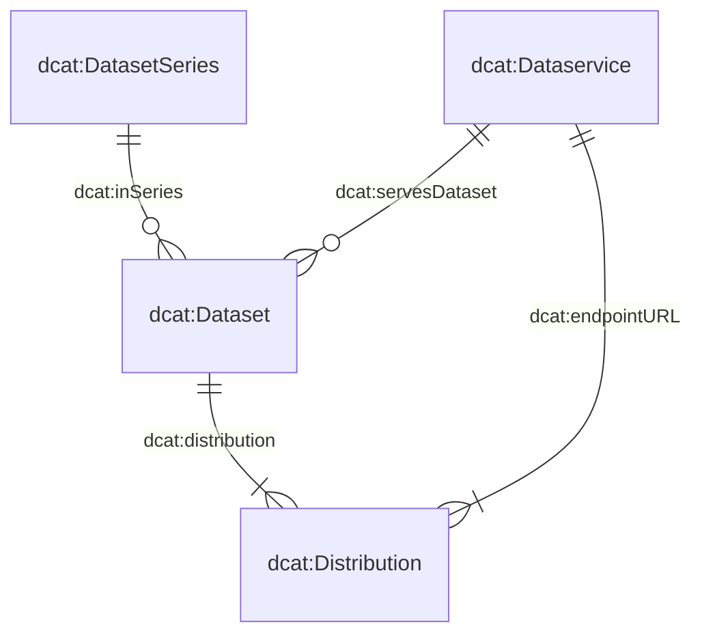

# Wie können Sie beitragen?
Bitte eröffnen Sie ein Issue, wenn Sie Anforderungen haben, die der Datenkatalog oder das Erfassungsformular erfüllen soll. Alternativ können Sie uns per E-Mail kontaktieren.

# Das Metadatenmodell

Das Metadatenmodell, das unserem System zugrunde liegt, besteht aus vier zentralen Klassen: `dcat:Dataset`, `dcat:DatasetSeries`, `dcat:Distribution` und `dcat:DataService`.
Das untenstehende Diagramm veranschaulicht die Beziehungen zwischen diesen Klassen:



Viele der Klassen und deren Attribute wurden direkt aus dem Swiss DCAT Application Profile (DCAT-AP CH) übernommen, wie auf [DCAT-AP CH](https://www.dcat-ap.ch/) detailliert beschrieben.
Um unseren spezifischen Anforderungen besser gerecht zu werden, haben wir diese Klassen durch zusätzliche Attribute erweitert, die mit dem Präfix `bv:` gekennzeichnet sind.

Insbesondere sind drei dieser Klassen — `dcat:Dataset`, `dcat:DatasetSeries` und `dcat:DataService` — in eigenen JSON-Schemata definiert. Die vierte Klasse, `dcat:Distribution`, wird im gleichen Schema wie `dcat:Dataset` beschrieben, was die strikte 1:n-Beziehung zwischen Datensätzen und Distributionen widerspiegelt.
Die Attribute dieser Schemata können Sie über die folgenden Links einsehen:

- [`dcat:Dataset` (with `dcat:Distribution`)](https://json-schema.app/view/%23?url=https%3A%2F%2Fraw.githubusercontent.com%2Fblw-ofag-ufag%2Fmetadata%2Frefs%2Fheads%2Fmain%2Fdata%2Fschemas%2Fdataset.json)
- [`dcat:DatasetSeries`)](https://json-schema.app/view/%23?url=https%3A%2F%2Fraw.githubusercontent.com%2Fblw-ofag-ufag%2Fmetadata%2Frefs%2Fheads%2Fmain%2Fdata%2Fschemas%2FdatasetSeries.json)
- [`dcat:Dataset`)](https://json-schema.app/view/%23?url=https%3A%2F%2Fraw.githubusercontent.com%2Fblw-ofag-ufag%2Fmetadata%2Frefs%2Fheads%2Fmain%2Fdata%2Fschemas%2FdataService.json)

Bitte beachten Sie, dass diese Seiten automatisch aus den tatsächlichen JSON-Schemata generiert werden, die [hier](https://github.com/blw-ofag-ufag/metadata/tree/main/data/schemas) gespeichert sind.

# Attribute
```

    "dcat:endpointURL": "URL-Adresse, wo der Datendienst aufgerufen werden kann.",
    "dcat:endpointDescription": "URL of technical documentation of the data service, such as for example a Swagger documentation.",
    "adms:status": "Status des Datenprodukts: Befindet es sich in Bearbeitung, ist es fertiggestellt usw.",
    "bv:abrogation": "Was ist das Aufhebungdatum?",
    "bv:archivalValue": "Hat das Datenprodukt aufgrund der darin enthaltenen administrativen, rechtlichen, steuerlichen, beweiskräftigen oder historischen Informationen einen anhaltenden Nutzen oder eine anhaltende Bedeutung, die seine weitere Aufbewahrung rechtfertigen?",
    "bv:classification": "Was ist die Klassifizierung der Datensammlung gemäss Informationssicherheitsgesetz (siehe Art. 13 ISG)?",
    "bv:externalCatalogs": "Soll das Datenprodukt auf anderen Plattformen wie i14y und/oder opendata.swiss veröffentlicht werden?",
    "bv:geoIdentifier": "Wie lautet der entsprechende Geoidentifikator gemäss Geoinformationsverordnung, Anhang 1?",
    "bv:itSystem": "In welchem IT-System wird Ihr Datenprodukt verwendet? Bitte geben Sie eine URL an.",
    "bv:personalData": "Was ist die Einordnung der Datensammlung gemäss Datenschutzgesetz (siehe Art. 5 DSG)?",
    "bv:retentionPeriod": "Wie lange muss Ihr Datenprodukt aufbewahrt werden?",
    "bv:typeOfData": "Welcher Typ beschreibt Ihr Datenprodukt am besten?",
    "dcat:accessService": "Ein Datendienst ermöglicht den Zugriff auf die Verbreitung des Datenprodukts.",
    "bv:dimensions": "Dimensionen beschreiben die Struktur der Verteilung – die enthaltenen Spalten/Konzepte – anhand von Schlüsseln aus dem gemeinsamen Dimensionsglossar.",
    "dcat:accessURL": "Die URL, über die der Zugang zur Ressource erfolgt (z.B. eine Landingpage oder ein Web-Formular). Die angegebene URL muss Informationen zum verwendeten Protokoll enthalten, z. B. https:// oder http://.",
    "dcat:contactPoint": "An wen sich der Datennutzer wenden sollte, wenn er Fragen oder Anmerkungen zum Inhalt der Datenprodukte hat. Bitte beachten Sie die Kontaktinformationen der Organisation.",
    "dcat:distribution": "Eine Instanz des Datenprodukts, die angezeigt oder genutzt werden kann. Beispielsweise kann eine Tabelle mit identischen Informationen als Excel-, CSV- oder JSON-Datei bereitgestellt werden. Die drei Dateien sind Verteilungen desselben Datenprodukts.",
    "dcat:downloadURL": "Direkter Download-Link zur Datei (z.B. CSV- oder PDF).",
    "dcat:inSeries": "Ist Ihr Datenprodukt Teil einer Datensatzreihe? Welcher?",
    "dcat:keyword": "Welche Schlüsselwörter sind hilfreich, um Ihr Datenprodukt zu finden? Es ist einfacher, Ihr Datenprodukt zu finden, wenn Sie mehrere Schlüsselwörter angeben, die auch in den Datenprodukten Ihrer Kollegen vorkommen.",
    "dcat:landingPage": "Wo finden Datenbenutzer zusätzliche Informationen zu Ihrem Datenprodukt oder der verantwortlichen Organisation?",
    "dcat:theme": "Thema, das zur Klassifizierung der Datenprodukte im Katalog verwendet wird.",
    "dcat:version": "Um welche Version handelt es sich? Bitte verwenden Sie semantische Versionsnummern in der Form X.Y.Z, wobei eine Erhöhung von X auf größere Änderungen, Y auf kleinere Änderungen und Z auf einfache Korrekturen wie Tippfehler hinweist.",
    "dcatap:applicableLegislation": "Diese Eigenschaft bezieht sich auf die Rechtsgrundlage des Datenprodukts.",
    "dcatap:availability": "Ist die Verfügbarkeit Ihres Datenprodukts vorübergehend, stabil oder experimentell?",
    "dct:accessRights": "Informationen, die angeben, ob das Datenprodukt offene Daten sind, Zugriffsbeschränkungen unterliegen oder nicht öffentlich sind.",
    "dct:accrualPeriodicity": "Häufigkeit, mit der das Datenprodukt aktualisiert wird.",
    "dct:conformsTo": "Entspricht Ihr Datenprodukt bestimmten Standards und/oder Spezifikationen?",
    "dct:description": "Bitte geben Sie eine Beschreibung an, damit der Datennutzer versteht, was das Datenprodukt enthält, wer ein potenzieller Nutzer ist und wofür das Datenprodukt verwendet wird.",
    "dct:format": "In welchem Dateiformat wird diese Distribution bereitgestellt?",
    "dct:issued": "Wann wurde das Datenprodukt ursprünglich veröffentlicht?",
    "dct:license": "Unter welcher Lizenz kann das Datenprodukt verwendet werden?",
    "dct:modified": "Wann wurde das Datenprodukt letztmals modifiziert?",
    "dct:publisher": "Wer ist die Herausgeberorganisation des Datenprodukts?",
    "dct:replaces": "Welches Datenprodukt wird ersetzt?",
    "dct:spatial": "Welchen geografischen Bereich deckt das Datenprodukt ab?",
    "dct:temporal": "Welcher Zeitraum wird von Ihrem Datenprodukt abgedeckt?",
    "dct:title": "Titel Ihres Datenprodukts",
    "foaf:page": "Gibt es Dokumentationen oder Webseiten, die dieses Datenprodukt näher beschreiben?",
    "prov:qualifiedAttribution": "Wer hat welche Rolle für dieses Datenprodukt?",
    "prov:wasDerivedFrom": "Von welchem anderen Datenprodukt wurde dieses Datenprodukt abgeleitet?",
    "prov:wasGeneratedBy": "Durch welchen Geschäftsprozess wurde dieses Datenprodukt generiert?",
    "schema:comment": "Gibt es weitere relevante Informationen zu diesem Datenprodukt?"


```

# Tagging-Richtlinien

Tags erfüllen mehrere Zwecke in unserem Datenkatalog.
Sie helfen Ihnen, Ihren Kolleginnen und Kollegen sowie externen Nutzenden, Datensätze rasch zu finden, zu organisieren und anzuzeigen, welche Themen oder Sachgebiete ein Datensatz abdeckt.

Durch die Wahl von guten, konsistenten Tags wird gewährleistet, dass sowohl Sie als auch andere die Daten leichter finden und wiederverwenden können.
Andere können Ihre Daten entdecken, indem sie nach einem Tag suchen, den sie möglicherweise bereits bei einem anderen Datensatz gesehen haben.

Fehlen wichtige Keywords, eröffnen Sie bitte ein Issue oder schreiben Sie uns eine Mail.
