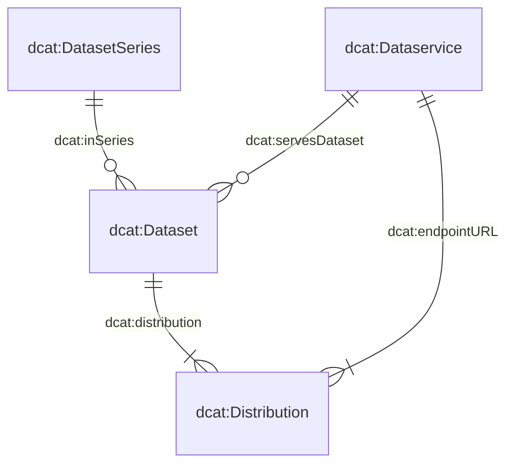

# Handbook

This handbook explains the key principles of the data catalogue and helps you describe and register data products correctly.

## How can you contribute?

The data catalogue relies on **complete, understandable and up-to-date metadata**.

If you know of a data product that is missing from the catalogue, or if information relating to an existing entry needs to be added or corrected, you can help improve it.

Suggestions for further developing the data catalogue or the data entry form are also welcome:

- Open a [GitHub issue](https://github.com/blw-ofag-ufag/data-catalog/issues) if you have a requirement or a suggestion for improving the data catalogue or the data entry form.
- Alternatively, you can contact us by email: agridata.ch@blw.admin.ch.

---

## The metadata model

The metadata model forms the basis for describing data products in the catalogue.

It is based on four central classes:

- `dcat:Dataset` – describes the actual data product
- `dcat:DatasetSeries` – groups several datasets that are related in terms of time or subject matter
- `dcat:Distribution` – describes a specific way of making a data product available, for example as a CSV, Excel or JSON file
- `dcat:DataService` – describes a service through which a data product can be accessed, for example an API

The relationships between these classes are defined in the metadata model.

Many classes and properties have been adopted directly from the [Swiss DCAT Application Profile (DCAT-AP CH)](https://www.dcat-ap.ch/).

To meet the specific requirements of FOAG and FSVO, the model has been extended with additional properties. These can be identified by the `bv:` prefix.

### JSON schemas

The three classes `dcat:Dataset`, `dcat:DatasetSeries` and `dcat:DataService` are each defined in a separate JSON schema.

`dcat:Distribution` is described together with `dcat:Dataset` in the `dataset.json` schema. This represents the relationship between a data product and its different ways of being made available.

The current schemas can be viewed here:

- [`dcat:Dataset` (including `dcat:Distribution`)](https://json-schema.app/view/%23?url=https%3A%2F%2Fraw.githubusercontent.com%2Fblw-ofag-ufag%2Fmetadata%2Frefs%2Fheads%2Fmain%2Fdata%2Fschemas%2Fdataset.json)
- [`dcat:DatasetSeries`](https://json-schema.app/view/%23?url=https%3A%2F%2Fraw.githubusercontent.com%2Fblw-ofag-ufag%2Fmetadata%2Frefs%2Fheads%2Fmain%2Fdata%2Fschemas%2FdatasetSeries.json)
- [`dcat:DataService`](https://json-schema.app/view/%23?url=https%3A%2F%2Fraw.githubusercontent.com%2Fblw-ofag-ufag%2Fmetadata%2Frefs%2Fheads%2Fmain%2Fdata%2Fschemas%2FdataService.json)

> **Note:** The pages linked above are generated automatically from the JSON schemas actually used by the system. The original schemas are stored in the [GitHub repository](https://github.com/blw-ofag-ufag/metadata/tree/main/data/schemas).

---

## Properties

The following properties contain the key information needed to describe a data product.

They support both the search process and the classification of a data product in terms of content, technology and organisation.

### Description and discoverability

| Property | Description |
|---|---|
| `dct:title` | Title of the data product. |
| `dct:description` | Description of the data product. The description should make it clear what the data product contains, who it is relevant to and what it can be used for. |
| `dcat:keyword` | Keywords that can be used to find the data product. Use several relevant and, where possible, consistent terms. Using terms that are also used for other data products makes searching easier. |
| `dcat:theme` | Theme used to classify the data product in the catalogue. |
| `dcat:landingPage` | Web page where data users can find additional information about the data product or the responsible organisation. |
| `foaf:page` | Documentation or web page providing further information about the data product. |
| `schema:comment` | Other relevant information about the data product. |

### Access and distribution

| Property | Description |
|---|---|
| `dcat:endpointURL` | URL at which a data service can be accessed. |
| `dcat:endpointDescription` | URL to the technical documentation of the data service, for example Swagger documentation. |
| `dcat:accessService` | Data service through which a distribution of the data product can be accessed. |
| `dcat:accessURL` | URL through which the resource can be accessed, e.g. a landing page or web form. The URL must include the protocol used, such as `https://` or `http://`. |
| `dcat:downloadURL` | Direct download link to a file, for example a CSV or PDF file. |
| `dcat:distribution` | Specific way in which a data product is made available. A data product can, for example, be provided as an Excel, CSV or JSON file. These files are different distributions of the same data product. |
| `dct:format` | File format of the respective distribution. |

### Responsibility and provenance

| Property | Description |
|---|---|
| `dcat:contactPoint` | Contact point for questions or comments concerning the content of the data product. Please use the contact details of the responsible organisation. |
| `dct:publisher` | Organisation publishing the data product. |
| `prov:qualifiedAttribution` | Persons or organisations and their respective roles in relation to the data product. |
| `prov:wasDerivedFrom` | Data product from which this data product was derived. |
| `dcat:inSeries` | Dataset series to which the data product belongs. |

### Legal and organisational aspects

| Property | Description |
|---|---|
| `dcatap:applicableLegislation` | Legal basis applicable to the data product. |
| `dct:accessRights` | Indicates whether the data product is openly accessible, subject to access restrictions or not public. |
| `dct:license` | Licence under which the data product can be used. |
| `bv:classification` | Classification of the data collection in accordance with the Information Security Act (see Art. 13 ISA). |
| `bv:personalData` | Classification of the data collection in accordance with the Data Protection Act (see Art. 5 DPA). |
| `bv:retentionPeriod` | Period for which the data product must be retained. |
| `bv:abrogation` | Date on which the data product is revoked or discontinued. |
| `bv:archivalValue` | Indicates whether the data product has lasting value or significance due to the administrative, legal, fiscal, evidentiary or historical information it contains, justifying its continued retention. |
| `bv:externalCatalogs` | Indicates whether the data product or its metadata should be published on other platforms such as [i14y](https://www.i14y.admin.ch/) and/or [opendata.swiss](https://opendata.swiss/). |
| `dcatap:availability` | Indicates whether the availability of the data product is temporary, stable or experimental. |

### Time, version and updates

| Property | Description |
|---|---|
| `dct:issued` | Date on which the data product was originally published. |
| `dct:modified` | Date of the last modification of the data product. |
| `dct:temporal` | Period covered by the data product. |
| `dct:accrualPeriodicity` | Frequency at which the data product is updated. |
| `dcat:version` | Version of the data product. Use semantic version numbers in the format `X.Y.Z`: an increase in `X` indicates a major change, `Y` a minor change and `Z` a correction, such as a typo fix. |
| `adms:status` | Status of the data product, for example in progress or completed. |
| `dct:replaces` | Data product that is replaced by this data product. |

### Subject-matter and technical classification

| Property | Description |
|---|---|
| `bv:typeOfData` | Type that best describes the data product. |
| `bv:dimensions` | Dimensions describe the structure of a distribution, for example the columns or concepts it contains. They are specified using keys from the common dimensions glossary. |
| `bv:geoIdentifier` | Corresponding geo-identifier in accordance with the Ordinance on Geoinformation, Annex 1. |
| `dct:spatial` | Geographical area covered by the data product. |
| `dct:conformsTo` | Standard or specification to which the data product conforms. |

---

## Tagging guidelines

Tags or keywords are an important part of the data catalogue. They help **users find data products quickly, classify them by subject and identify connections between them**.

Good tagging is therefore important not only for your own entry. It also helps colleagues discover data products when they search for a term that has already been used for another data product.

### Choosing good tags

When assigning tags, please follow these principles in particular:

- **Relevant:** Use terms that actually describe the content and subject of the data product.
- **Consistent:** Where possible, use the same terms as for comparable data products.
- **Multiple terms:** Use several relevant keywords when different terms are useful for describing or finding the data product.
- **Understandable:** Choose terms that can also be understood by people who are not directly involved in creating the data product.
- **Prefer existing terms:** Before creating a new tag, check whether a suitable term is already used in the catalogue.

### Example

A data product relating to milk production could, for example, use the following tags:

`milk production`, `milk`, `agriculture`, `animal husbandry`

The tags that are actually appropriate depend on the specific content of the data product and the existing vocabulary in the catalogue.

### Missing tags or terms

If important terms or keywords are missing from the catalogue, please let us know:

- Open a [GitHub issue](https://github.com/blw-ofag-ufag/data-catalog/issues), or
- contact us by email.

Together, we can ensure that terms are used consistently and that data products are as easy to find as possible.
