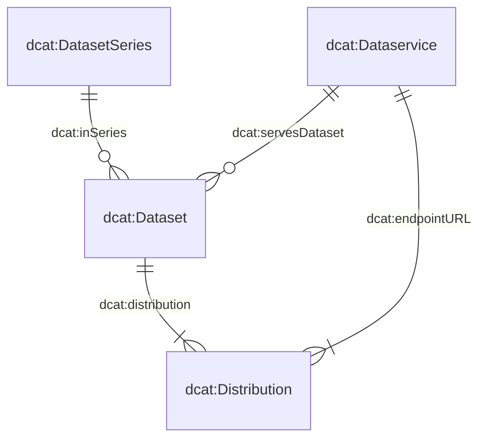

# How to contribute?
Please open an Issue if you have requirements that the data catalog or the entry form should meet. Alternatively, you can reach us per mail.

# The metadata model

The metadata model underpinning our system is comprised of four core classes: `dcat:Dataset`, `dcat:DatasetSeries`, `dcat:Distribution`, and `dcat:DataService`. The diagram below illustrates the relationships among these classes:



Many of the classes and their attributes are directly derived from the Swiss DCAT Application Profile (DCAT-AP CH), as detailed on [DCAT-AP CH](https://www.dcat-ap.ch/). To better accommodate our specific requirements, we have further augmented these classes with additional attributes, denoted by the prefix `bv:`.

In particular, three of these classes — `dcat:Dataset`, `dcat:DatasetSeries`, and `dcat:DataService` — are defined in dedicated JSON schemas. The fourth class, `dcat:Distribution`, is described within the same schema as `dcat:Dataset`, reflecting the strict 1:n relationship between datasets and distributions. You can explore the attributes of these schemas via the following links:

- [`dcat:Dataset` (with `dcat:Distribution`)](https://json-schema.app/view/%23?url=https%3A%2F%2Fraw.githubusercontent.com%2Fblw-ofag-ufag%2Fmetadata%2Frefs%2Fheads%2Fmain%2Fdata%2Fschemas%2Fdataset.json)
- [`dcat:DatasetSeries`](https://json-schema.app/view/%23?url=https%3A%2F%2Fraw.githubusercontent.com%2Fblw-ofag-ufag%2Fmetadata%2Frefs%2Fheads%2Fmain%2Fdata%2Fschemas%2FdatasetSeries.json)
- [`dcat:Dataset`](https://json-schema.app/view/%23?url=https%3A%2F%2Fraw.githubusercontent.com%2Fblw-ofag-ufag%2Fmetadata%2Frefs%2Fheads%2Fmain%2Fdata%2Fschemas%2FdataService.json)

Please note that these pages are automatically generated from the actual JSON schemas stored [here](https://github.com/blw-ofag-ufag/metadata/tree/main/data/schemas).

# Attributes
```
    "adms:status": "Status of the data product: Is it work in progress, finished etc.",
    "bv:abrogation": "What is the abrogation date?",
    "bv:archivalValue": "Does the data product have ongoing usefulness or significance, based on the administrative, legal, fiscal, evidential, or historical information they contain, which justifies their continued preservation.",
    "bv:classification": "What is the classification of data set according to the Information Security Act (see Art. 13 ISA)?",
    "bv:externalCatalogs": "Shall the data product be published on other plattforms such as i14y and or opendata.swiss?",
    "bv:geoIdentifier": "What is the corresponding geoidentifier according to Geoinformationsverordnung, Appendix 1.",
    "bv:itSystem": "What IT system is your data product used in? Please provide an URL.",
    "bv:personalData": "What is the classification of data set according to the Data Protection Act (see Art. 5 FADP)?",
    "bv:retentionPeriod": "How long does your data product need to be retained?",
    "bv:typeOfData": "What type best describes your data product?",
    "dcat:accessService": "A data service gives access to the distribution of the data product.",
    "bv:dimensions": "Dimensions describe the structure of the distribution — the columns/concepts it contains — using keys from the shared dimension glossary.",
    "dcat:accessURL": "The URL that gives access to a distribution of the data product. The resource at the access URL may contain information about how to get the Dataset. The URL provided must contain the information on the used protocol, i.e. https:// or http://",
    "dcat:contactPoint": "Who should be contacted if the data user has questions or comments concerning the data products content. Please refer to an organizations contact information",
    "dcat:distribution": "An instance of the data product that can be viewed or consumed. For example a table containing the identic information can be provided as an excel-, csv- or json-file. The three files are distributions of the same data product.",
    "dcat:downloadURL": "Direct URL to download the data product.",
    "dcat:inSeries": "Is your data product part of a dataset series? Which one?",
    "dcat:keyword": "What keywords are helpful to find your dataproduct? It is easier to find your data product if you provide several keywords that are shared with your collegues data products.",
    "dcat:landingPage": "Where can a data user find additional context to your data product or the responsible organization?",
    "dcat:theme": "Theme used to classify the catalogue's data products.",
    "dcat:version": "What version is this? Please use semantic versioning in the form of X.Y.Z where increases of X indicate major changes, Y minor changes and Z simple corrections such as typos.",
    "dcatap:applicableLegislation": "This property refers to the legal basis of the data product",
    "dcatap:availability": "Is the availability of your data product temporary, stable, experimental?",
    "dct:accessRights": "Information that indicates whether the data product is open data, has access restrictions or is not public.",
    "dct:accrualPeriodicity": "Frequency at which the data product is updated.",
    "dct:conformsTo": "Does your data product conform to specific standards and/or specifications?",
    "dct:description": "Please provide a description so that the data user understand what the data product contains, who is a potential user, and what the data product is used for.",
    "dct:format": "What file format does this distribution have.",
    "dct:issued": "When was the data product originally issued?",
    "dct:license": "Under what license can the data product be used?",
    "dct:modified": "When was the data product last modified?",
    "dct:publisher": "Who is the data products publisher organization?",
    "dct:replaces": "Which  data product is replaced?",
    "dct:spatial": "What geographic region is covered by the data product?",
    "dct:temporal": "What time period is covered in your data product",
    "dct:title": "Title of your data product",
    "foaf:page": "What other data products are linked to this one?",
    "prov:qualifiedAttribution": "Who has which role for this data product?",
    "prov:wasDerivedFrom": "What other data product whas this data product derived from?",
    "prov:wasGeneratedBy": "What business process has generated this data product?",
    "schema:comment": "Is the other relevant information to this data product?"
```

# Tagging guidelines

Tags serve multiple purposes in our data catalog.
They help you, your colleagues, and external users quickly discover and organize datasets, as well as indicate which themes or topics a dataset covers.
By selecting good, consistent tags, you ensure that both you and others can locate and reuse the data more easily.
They can find your data by searching for a tag they may have found under another data set (with the same tag).

If important keywords are missing, please open an Issue or contact us by mail.
