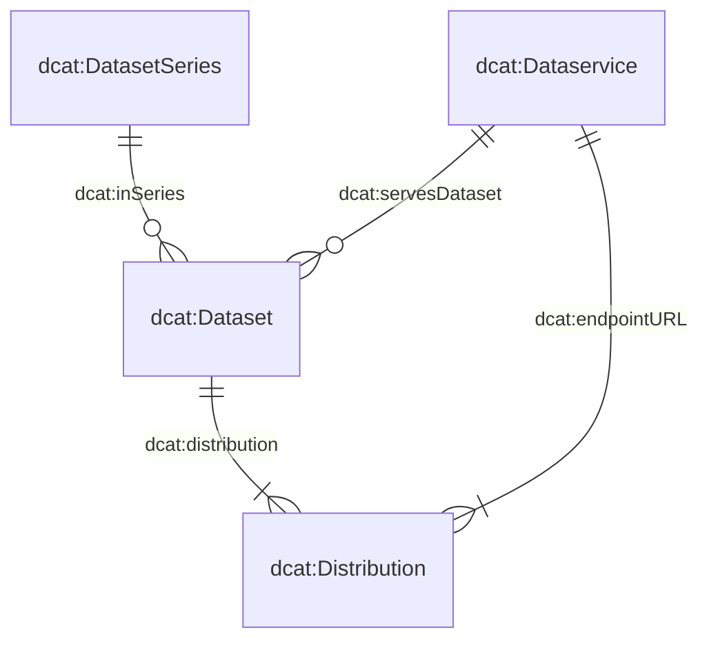

# Manuel

---

Ce manuel présente les principaux éléments du catalogue de données et vous aide à décrire et à enregistrer correctement les produits de données.

## Comment pouvez-vous contribuer ?

Le catalogue de données repose sur des **métadonnées complètes, compréhensibles et à jour**.

Si vous connaissez un produit de données qui ne figure pas encore dans le catalogue, ou si des informations relatives à une entrée existante doivent être complétées ou corrigées, vous pouvez contribuer à son amélioration.

Les suggestions concernant le développement du catalogue de données ou du formulaire de saisie sont également les bienvenues :

- Ouvrez une [issue GitHub](https://github.com/blw-ofag-ufag/data-catalog/issues) si vous avez une demande ou une proposition d'amélioration concernant le catalogue de données ou le formulaire de saisie.
- Vous pouvez également nous contacter par e-mail : agridata.ch@blw.admin.ch.

---

## Le modèle de métadonnées

Le modèle de métadonnées constitue la base de la description des produits de données dans le catalogue.

Il repose sur quatre classes centrales :

- `dcat:Dataset` – décrit le produit de données proprement dit
- `dcat:DatasetSeries` – regroupe plusieurs jeux de données liés entre eux sur le plan temporel ou thématique
- `dcat:Distribution` – décrit une forme concrète de mise à disposition d'un produit de données, par exemple sous forme de fichier CSV, Excel ou JSON
- `dcat:DataService` – décrit un service permettant d'accéder à un produit de données, par exemple une API

Les relations entre ces classes sont définies dans le modèle de métadonnées.

De nombreuses classes et propriétés ont été reprises directement du [Swiss DCAT Application Profile (DCAT-AP CH)](https://www.dcat-ap.ch/).

Afin de répondre aux besoins spécifiques de l'OFAG et de l'OSAV, le modèle a été complété par des propriétés supplémentaires. Celles-ci sont reconnaissables au préfixe `bv:`.

### Schémas JSON

Les trois classes `dcat:Dataset`, `dcat:DatasetSeries` et `dcat:DataService` sont chacune définies dans un schéma JSON spécifique.

`dcat:Distribution` est décrite conjointement avec `dcat:Dataset` dans le schéma `dataset.json`. Cela permet de représenter la relation entre un produit de données et ses différentes formes de mise à disposition.

Les schémas actuels peuvent être consultés ici :

- [`dcat:Dataset` (y compris `dcat:Distribution`)](https://json-schema.app/view/%23?url=https%3A%2F%2Fraw.githubusercontent.com%2Fblw-ofag-ufag%2Fmetadata%2Frefs%2Fheads%2Fmain%2Fdata%2Fschemas%2Fdataset.json)
- [`dcat:DatasetSeries`](https://json-schema.app/view/%23?url=https%3A%2F%2Fraw.githubusercontent.com%2Fblw-ofag-ufag%2Fmetadata%2Frefs%2Fheads%2Fmain%2Fdata%2Fschemas%2FdatasetSeries.json)
- [`dcat:DataService`](https://json-schema.app/view/%23?url=https%3A%2F%2Fraw.githubusercontent.com%2Fblw-ofag-ufag%2Fmetadata%2Frefs%2Fheads%2Fmain%2Fdata%2Fschemas%2FdataService.json)

> **Remarque :** Les pages mentionnées ci-dessus sont générées automatiquement à partir des schémas JSON effectivement utilisés. Les schémas originaux sont disponibles dans le [dépôt GitHub](https://github.com/blw-ofag-ufag/metadata/tree/main/data/schemas).

---

## Propriétés

Les propriétés suivantes regroupent les principales informations nécessaires à la description d'un produit de données.

Elles facilitent à la fois la recherche et la classification d'un produit de données sur les plans du contenu, de la technique et de l'organisation.

### Description et recherche

| Propriété | Description |
|---|---|
| `dct:title` | Titre du produit de données. |
| `dct:description` | Description du produit de données. La description doit permettre de comprendre quels contenus sont couverts par le produit de données, à qui il s'adresse et à quelles fins il peut être utilisé. |
| `dcat:keyword` | Mots-clés permettant de trouver le produit de données. Utilisez plusieurs termes pertinents et, dans la mesure du possible, cohérents. L'utilisation de termes également employés pour d'autres produits de données facilite la recherche. |
| `dcat:theme` | Thème utilisé pour la classification thématique du produit de données dans le catalogue. |
| `dcat:landingPage` | Page web sur laquelle les utilisateurs peuvent trouver des informations supplémentaires sur le produit de données ou sur l'organisation responsable. |
| `foaf:page` | Documentation ou page web décrivant plus en détail le produit de données. |
| `schema:comment` | Autres informations pertinentes concernant le produit de données. |

### Accès et mise à disposition

| Propriété | Description |
|---|---|
| `dcat:endpointURL` | URL à laquelle un service de données peut être appelé. |
| `dcat:endpointDescription` | URL vers la documentation technique du service de données, par exemple une documentation Swagger. |
| `dcat:accessService` | Service de données permettant d'accéder à une distribution du produit de données. |
| `dcat:accessURL` | URL permettant d'accéder à la ressource, par exemple une page de destination ou un formulaire web. L'URL doit contenir le protocole utilisé, par exemple `https://` ou `http://`. |
| `dcat:downloadURL` | Lien de téléchargement direct vers un fichier, par exemple un fichier CSV ou PDF. |
| `dcat:distribution` | Forme concrète de mise à disposition d'un produit de données. Un produit de données peut par exemple être proposé sous forme de fichier Excel, CSV ou JSON. Ces fichiers constituent différentes distributions du même produit de données. |
| `dct:format` | Format de fichier de la distribution concernée. |

### Responsabilité et provenance

| Propriété | Description |
|---|---|
| `dcat:contactPoint` | Point de contact pour les questions ou remarques concernant le contenu du produit de données. Veuillez utiliser les coordonnées de l'organisation compétente. |
| `dct:publisher` | Organisation qui publie le produit de données. |
| `prov:qualifiedAttribution` | Personnes ou organisations ainsi que leurs rôles respectifs en relation avec le produit de données. |
| `prov:wasDerivedFrom` | Produit de données à partir duquel ce produit de données a été dérivé. |
| `dcat:inSeries` | Série de jeux de données à laquelle appartient le produit de données. |

### Aspects juridiques et organisationnels

| Propriété | Description |
|---|---|
| `dcatap:applicableLegislation` | Base légale applicable au produit de données. |
| `dct:accessRights` | Indique si le produit de données est librement accessible, soumis à des restrictions d'accès ou non public. |
| `dct:license` | Licence sous laquelle le produit de données peut être utilisé. |
| `bv:classification` | Classification de la collecte de données conformément à la loi sur la sécurité de l'information (voir art. 13 LSI). |
| `bv:personalData` | Classification de la collecte de données conformément à la loi sur la protection des données (voir art. 5 LPD). |
| `bv:retentionPeriod` | Durée pendant laquelle le produit de données doit être conservé. |
| `bv:abrogation` | Date d'abrogation du produit de données. |
| `bv:archivalValue` | Indique si le produit de données présente, en raison des informations administratives, juridiques, fiscales, probatoires ou historiques qu'il contient, une utilité ou une importance durable justifiant sa conservation à long terme. |
| `bv:externalCatalogs` | Indique si le produit de données ou ses métadonnées doivent être publiés sur d'autres plateformes telles que [i14y](https://www.i14y.admin.ch/) et/ou [opendata.swiss](https://opendata.swiss/). |
| `dcatap:availability` | Indique si la disponibilité du produit de données est temporaire, stable ou expérimentale. |

### Temps, version et mise à jour

| Propriété | Description |
|---|---|
| `dct:issued` | Date à laquelle le produit de données a été publié pour la première fois. |
| `dct:modified` | Date de la dernière modification du produit de données. |
| `dct:temporal` | Période couverte par le produit de données. |
| `dct:accrualPeriodicity` | Fréquence à laquelle le produit de données est mis à jour. |
| `dcat:version` | Version du produit de données. Utilisez des numéros de version sémantique au format `X.Y.Z` : une augmentation de `X` indique une modification majeure, de `Y` une modification mineure et de `Z` une correction, par exemple d'une faute de frappe. |
| `adms:status` | Statut du produit de données, par exemple en cours de traitement ou terminé. |
| `dct:replaces` | Produit de données remplacé par ce produit de données. |

### Classification thématique et technique

| Propriété | Description |
|---|---|
| `bv:typeOfData` | Type qui décrit le mieux le produit de données. |
| `bv:dimensions` | Les dimensions décrivent la structure d'une distribution, par exemple les colonnes ou concepts qu'elle contient. Elles sont indiquées à l'aide de clés provenant du glossaire commun des dimensions. |
| `bv:geoIdentifier` | Identifiant géographique correspondant conformément à l'ordonnance sur la géoinformation, annexe 1. |
| `dct:spatial` | Zone géographique couverte par le produit de données. |
| `dct:conformsTo` | Norme ou spécification à laquelle le produit de données est conforme. |

---

## Directives relatives aux tags

Les tags ou mots-clés constituent un élément important du catalogue de données. Ils permettent de **trouver rapidement les produits de données, de les classer par thème et de les mettre en relation**.

Un bon système de tags n'est donc pas seulement important pour sa propre entrée. Il aide également les collègues à découvrir des produits de données lorsqu'ils recherchent un terme déjà utilisé pour un autre produit de données.

### Choisir de bons tags

Lors de l'attribution des tags, veuillez notamment respecter les principes suivants :

- **Pertinence :** utilisez des termes qui décrivent réellement le contenu et le thème du produit de données.
- **Cohérence :** utilisez autant que possible les mêmes termes que pour des produits de données comparables.
- **Plusieurs termes :** utilisez plusieurs mots-clés pertinents lorsque différents termes sont utiles pour décrire ou rechercher le produit de données.
- **Compréhensibilité :** choisissez des termes qui peuvent également être compris par des personnes qui ne participent pas directement à la création du produit de données.
- **Privilégier les termes existants :** avant de créer un nouveau tag, vérifiez si un terme approprié est déjà utilisé dans le catalogue.

### Exemple

Un produit de données concernant la production de lait pourrait par exemple être associé aux tags suivants :

`production laitière`, `lait`, `agriculture`, `élevage`

Les tags réellement pertinents dépendent du contenu concret du produit de données et du vocabulaire existant dans le catalogue.

### Tags ou termes manquants

Si des termes ou mots-clés importants manquent dans le catalogue, n'hésitez pas à nous en informer :

- Ouvrez une [issue GitHub](https://github.com/blw-ofag-ufag/data-catalog/issues), ou
- contactez-nous par e-mail.

Ensemble, nous pouvons ainsi garantir une utilisation cohérente des termes et faire en sorte que les produits de données soient aussi faciles que possible à trouver.

