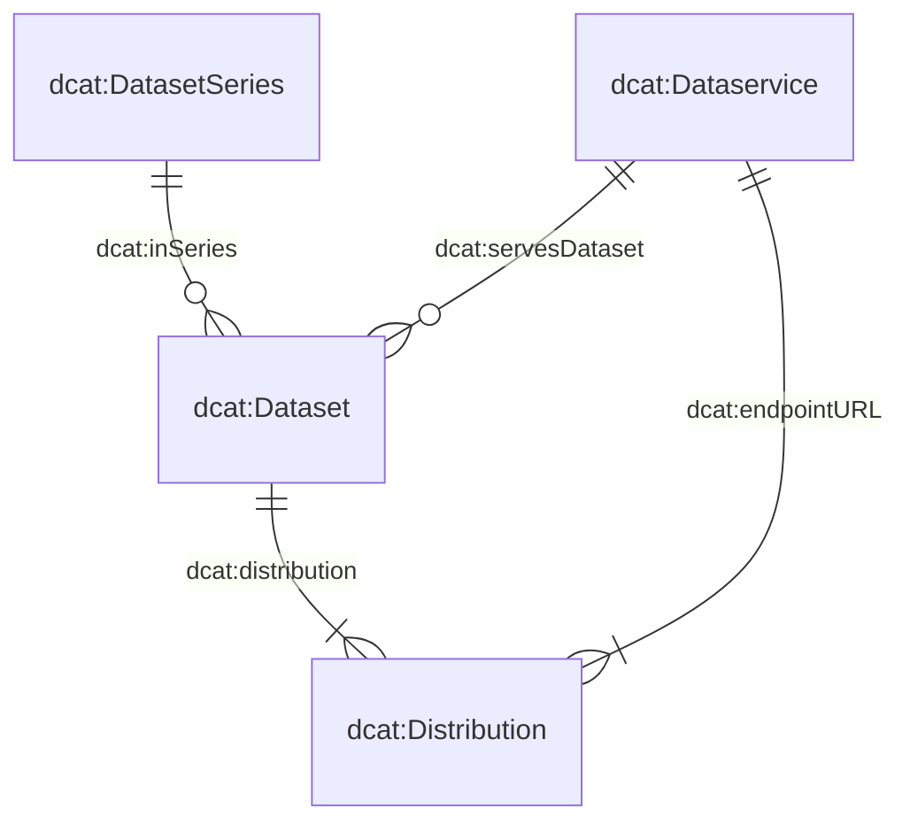

# Comment contribuer?
Veuillez ouvrir une « Issue » (ticket) si vous avez des besoins auxquels le catalogue de données ou le formulaire de saisie doit répondre. Vous pouvez également nous contacter par e-mail.

# Le modèle de métadonnées

Le modèle de métadonnées qui sous-tend notre système se compose de quatre classes principales : `dcat:Dataset`, `dcat:DatasetSeries`, `dcat:Distribution` et `dcat:DataService`.
Le diagramme ci-dessous illustre les relations entre ces classes:



De nombreuses classes et leurs attributs ont été directement dérivés du Swiss DCAT Application Profile (DCAT-AP CH), tel que détaillé sur [DCAT-AP CH](https://www.dcat-ap.ch/).
Afin de mieux répondre à nos exigences spécifiques, nous avons enrichi ces classes avec des attributs supplémentaires, indiqués par le préfixe `bv:`.

En particulier, trois de ces classes — `dcat:Dataset`, `dcat:DatasetSeries` et `dcat:DataService` — sont définies dans des schémas JSON dédiés.
La quatrième classe, `dcat:Distribution`, est décrite dans le même schéma que `dcat:Dataset`, ce qui reflète la relation stricte 1:n entre les ensembles de données et les distributions.
Vous pouvez consulter les attributs de ces schémas via les liens suivants :

- [`dcat:Dataset` (with `dcat:Distribution`)](https://json-schema.app/view/%23?url=https%3A%2F%2Fraw.githubusercontent.com%2Fblw-ofag-ufag%2Fmetadata%2Frefs%2Fheads%2Fmain%2Fdata%2Fschemas%2Fdataset.json)
- [`dcat:DatasetSeries`](https://json-schema.app/view/%23?url=https%3A%2F%2Fraw.githubusercontent.com%2Fblw-ofag-ufag%2Fmetadata%2Frefs%2Fheads%2Fmain%2Fdata%2Fschemas%2FdatasetSeries.json)
- [`dcat:DataService`](https://json-schema.app/view/%23?url=https%3A%2F%2Fraw.githubusercontent.com%2Fblw-ofag-ufag%2Fmetadata%2Frefs%2Fheads%2Fmain%2Fdata%2Fschemas%2FdataService.json)

Veuillez noter que ces pages sont générées automatiquement à partir des schémas JSON réels stockés [ici](https://github.com/blw-ofag-ufag/metadata/tree/main/data/schemas).

# Attribute

```
    "adms:status": "Statut du produit de données : en cours de traitement, terminé, etc.",
    "bv:abrogation": "Quelle est la date d'abrogation ?",
    "bv:archivalValue": "Le produit de données présente-t-il, en raison des informations administratives, juridiques, fiscales, probantes ou historiques qu'il contient, une utilité ou une importance durable qui justifie sa conservation ?",
    "bv:classification": "Quelle est la classification de la collecte de données selon la loi sur la sécurité de l'information (voir art. 13 LSI) ?",
    "bv:externalCatalogs": "Le produit de données doit-il être publié sur d'autres plateformes telles que i14y et/ou opendata.swiss ?",
    "bv:geoIdentifier": "Quel est le géo-identificateur correspondant selon l'annexe 1 de l'ordonnance sur la géoinformation ?",
    "bv:itSystem": "Dans quel système informatique votre produit de données est-il utilisé ? Veuillez indiquer une URL.",
    "bv:personalData": "Quel est le classification de la collecte de données selon la loi sur la protection des données (voir art. 5 LPD) ?",
    "bv:retentionPeriod": "Combien de temps votre produit de données doit-il être conservé ?",
    "bv:typeOfData": "Quel type décrit le mieux votre produit de données ?",
    "dcat:accessService": "Un service de données permet d'accéder à la diffusion du produit de données.",
    "bv:dimensions": "Les dimensions décrivent la structure de la distribution – les colonnes/concepts qu'elle contient – à l'aide de clés du glossaire des dimensions.",
    "dcat:accessURL": "L'URL via laquelle l'accès à la ressource est effectué (par exemple, une page d'accueil ou un formulaire Web). L'URL indiquée doit contenir des informations sur le protocole utilisé, c'est-à-dire https:// ou http://.",
    "dcat:contactPoint": "À qui l'utilisateur des données peut-il s'adresser s'il a des questions ou des remarques concernant le contenu du produit de données ? Veuillez indiquer les coordonnées d'une organisation.",
    "dcat:distribution": "Une instance du produit de données qui peut être affichée ou utilisée. Par exemple, un tableau contenant des informations identiques peut être fourni sous forme de fichier Excel, CSV ou JSON. Ces trois fichiers sont des distributions du même produit de données.",
    "dcat:downloadURL": "Lien de téléchargement direct vers le fichier (par exemple CSV ou PDF).",
    "dcat:inSeries": "Votre produit de données fait-il partie d'une série de données ? Laquelle ?",
    "dcat:keyword": "Quels mots-clés sont utiles pour trouver votre produit de données ? Il est plus facile de trouver votre produit de données si vous indiquez plusieurs mots-clés qui apparaissent également dans les produits de données de vos collègues.",
    "dcat:landingPage": "Où les utilisateurs de données peuvent-ils trouver des informations supplémentaires sur votre produit de données ou l'organisation responsable ?",
    "dcat:theme": "Thème utilisé pour classer les produits de données dans le catalogue.",
    "dcat:version": "De quelle version s'agit-il ? Veuillez utiliser des numéros de version sémantiques sous la forme X.Y.Z, où une augmentation de X indique des modifications importantes, Y des modifications mineures et Z des corrections simples telles que des fautes de frappe.",
    "dcatap:applicableLegislation": "Cette propriété se rapporte à la base juridique du produit de données.",
    "dcatap:availability": "La disponibilité de votre produit de données est-elle temporaire, stable ou expérimentale ?",
    "dct:accessRights": "Informations indiquant si le produit de données est une donnée ouverte, s'il existe des restrictions d'accès ou s'il n'est pas public.",
    "dct:accrualPeriodicity": "Fréquence à laquelle le produit de données est mis à jour.",
    "dct:conformsTo": "Votre produit de données est-il conforme à certaines normes et/ou spécifications ?",
    "dct:description": "Veuillez fournir une description afin que l'utilisateur des données comprenne ce que contient le produit de données, qui est un utilisateur potentiel et à quoi sert le produit de données.",
    "dct:format": "Quel est le format de fichier de cette distribution ?",
    "dct:issued": "Quand le produit de données a-t-il été publié pour la première fois ?",
    "dct:license": "Sous quelle licence le produit de données peut-il être utilisé ?",
    "dct:modified": "Quand le produit de données a-t-il été modifié pour la dernière fois ?",
    "dct:publisher": "Qui est l'éditeur du produit de données ?",
    "dct:replaces": "Quel produit de données est remplacé ?",
    "dct:spatial": "Quelle zone géographique couvre le produit de données ?",
    "dct:temporal": "Quelle période votre produit de données couvre-t-il ?",
    "dct:title": "Titre de votre produit de données",
    "foaf:page": "Existe-t-il des documentations ou des sites web qui décrivent plus en détail ce produit de données ?",
    "prov:qualifiedAttribution": "Qui joue quel rôle dans ce produit de données ?",
    "prov:wasDerivedFrom": "De quel autre produit de données ce produit de données est-il dérivé ?",
    "prov:wasGeneratedBy": "Par quel processus métier ce produit de données a-t-il été généré ?",
    "schema:comment": "Votre produit de données est-il conforme à certaines normes et/ou spécifications ?"

```

# Directives pour les tags

Les tags servent plusieurs objectifs dans notre catalogue de données.
Ils aident vous-même, vos collègues et les utilisateurs externes à rapidement trouver et organiser des jeux de données, ainsi qu’à identifier les thèmes ou sujets qu'un jeu de données couvre.
En choisissant des tags pertinents et cohérents, vous permettez à chacun, y compris vous-même, de trouver et réutiliser plus facilement les données.
Les utilisateurs peuvent découvrir vos données en recherchant un tag qu'ils auraient vu sur un autre jeu de données.

Si des mots-clés importants manquent, veuillez ouvrir une « issue » ou nous envoyer un e-mail.
