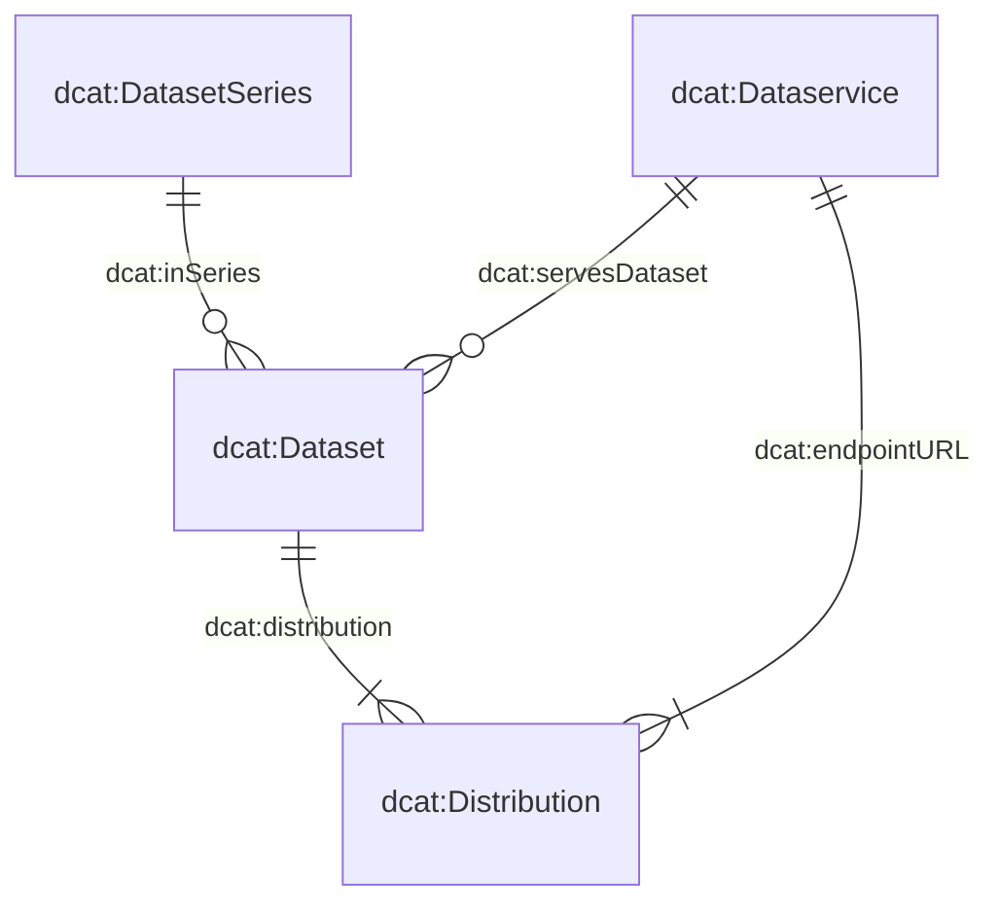

# Manuale

---

Questo manuale illustra i principali elementi del catalogo dei dati e fornisce supporto per descrivere e registrare correttamente i prodotti di dati.

## Come potete contribuire?

Il catalogo dei dati si basa su **metadati completi, comprensibili e aggiornati**.

Se conoscete un prodotto di dati che non è ancora presente nel catalogo, oppure se le informazioni relative a una voce esistente devono essere completate o corrette, potete contribuire al suo miglioramento.

Sono inoltre benvenuti suggerimenti per l'ulteriore sviluppo del catalogo dei dati o del modulo di registrazione:

- Aprite una [issue su GitHub](https://github.com/blw-ofag-ufag/data-catalog/issues) se avete una richiesta o una proposta di miglioramento relativa al catalogo dei dati o al modulo di registrazione.
- In alternativa, potete contattarci via e-mail: agridata.ch@blw.admin.ch.

---

## Il modello di metadati

Il modello di metadati costituisce la base per la descrizione dei prodotti di dati nel catalogo.

Si basa su quattro classi centrali:

- `dcat:Dataset` – descrive il prodotto di dati vero e proprio
- `dcat:DatasetSeries` – raggruppa diversi set di dati collegati tra loro dal punto di vista temporale o tematico
- `dcat:Distribution` – descrive una modalità concreta di messa a disposizione di un prodotto di dati, ad esempio sotto forma di file CSV, Excel o JSON
- `dcat:DataService` – descrive un servizio attraverso il quale è possibile accedere a un prodotto di dati, ad esempio un'API

Le relazioni tra queste classi sono definite nel modello di metadati.

Molte classi e proprietà sono state riprese direttamente dallo [Swiss DCAT Application Profile (DCAT-AP CH)](https://www.dcat-ap.ch/).

Per soddisfare i requisiti specifici dell'UFAG e dell'USAV, il modello è stato ampliato con proprietà aggiuntive. Queste sono riconoscibili dal prefisso `bv:`.

### Schemi JSON

Le tre classi `dcat:Dataset`, `dcat:DatasetSeries` e `dcat:DataService` sono definite ciascuna in uno schema JSON separato.

`dcat:Distribution` è descritta insieme a `dcat:Dataset` nello schema `dataset.json`. In questo modo viene rappresentata la relazione tra un prodotto di dati e le sue diverse modalità di messa a disposizione.

Gli schemi attuali possono essere consultati qui:

- [`dcat:Dataset` (incl. `dcat:Distribution`)](https://json-schema.app/view/%23?url=https%3A%2F%2Fraw.githubusercontent.com%2Fblw-ofag-ufag%2Fmetadata%2Frefs%2Fheads%2Fmain%2Fdata%2Fschemas%2Fdataset.json)
- [`dcat:DatasetSeries`](https://json-schema.app/view/%23?url=https%3A%2F%2Fraw.githubusercontent.com%2Fblw-ofag-ufag%2Fmetadata%2Frefs%2Fheads%2Fmain%2Fdata%2Fschemas%2FdatasetSeries.json)
- [`dcat:DataService`](https://json-schema.app/view/%23?url=https%3A%2F%2Fraw.githubusercontent.com%2Fblw-ofag-ufag%2Fmetadata%2Frefs%2Fheads%2Fmain%2Fdata%2Fschemas%2FdataService.json)

> **Nota:** Le pagine sopra indicate vengono generate automaticamente dagli schemi JSON effettivamente utilizzati. Gli schemi originali sono archiviati nel [repository GitHub](https://github.com/blw-ofag-ufag/metadata/tree/main/data/schemas).

---

## Proprietà

Le proprietà seguenti raccolgono le principali informazioni necessarie per descrivere un prodotto di dati.

Queste informazioni facilitano sia la ricerca sia la classificazione di un prodotto di dati dal punto di vista dei contenuti, tecnico e organizzativo.

### Descrizione e reperibilità

| Proprietà | Descrizione |
|---|---|
| `dct:title` | Titolo del prodotto di dati. |
| `dct:description` | Descrizione del prodotto di dati. La descrizione dovrebbe permettere di comprendere quali contenuti comprende il prodotto di dati, per chi è rilevante e per quali scopi può essere utilizzato. |
| `dcat:keyword` | Parole chiave che permettono di trovare il prodotto di dati. Utilizzate più termini pertinenti e, ove possibile, coerenti. L'utilizzo di termini usati anche per altri prodotti di dati facilita la ricerca. |
| `dcat:theme` | Tema utilizzato per la classificazione tematica del prodotto di dati nel catalogo. |
| `dcat:landingPage` | Pagina web sulla quale gli utenti dei dati possono trovare ulteriori informazioni sul prodotto di dati o sull'organizzazione responsabile. |
| `foaf:page` | Documentazione o pagina web che descrive più dettagliatamente il prodotto di dati. |
| `schema:comment` | Ulteriori informazioni rilevanti sul prodotto di dati. |

### Accesso e messa a disposizione

| Proprietà | Descrizione |
|---|---|
| `dcat:endpointURL` | URL al quale è possibile accedere a un servizio di dati. |
| `dcat:endpointDescription` | URL alla documentazione tecnica del servizio di dati, ad esempio alla documentazione Swagger. |
| `dcat:accessService` | Servizio di dati attraverso il quale è possibile accedere a una distribuzione del prodotto di dati. |
| `dcat:accessURL` | URL attraverso il quale è possibile accedere alla risorsa, ad esempio una landing page o un modulo web. L'URL deve contenere il protocollo utilizzato, ad esempio `https://` o `http://`. |
| `dcat:downloadURL` | Link diretto per il download di un file, ad esempio un file CSV o PDF. |
| `dcat:distribution` | Modalità concreta con cui un prodotto di dati viene messo a disposizione. Un prodotto di dati può, ad esempio, essere fornito come file Excel, CSV o JSON. Questi file costituiscono diverse distribuzioni dello stesso prodotto di dati. |
| `dct:format` | Formato del file della relativa distribuzione. |

### Responsabilità e provenienza

| Proprietà | Descrizione |
|---|---|
| `dcat:contactPoint` | Punto di contatto per domande o osservazioni relative al contenuto del prodotto di dati. Utilizzate i dati di contatto dell'organizzazione competente. |
| `dct:publisher` | Organizzazione che pubblica il prodotto di dati. |
| `prov:qualifiedAttribution` | Persone o organizzazioni e i rispettivi ruoli in relazione al prodotto di dati. |
| `prov:wasDerivedFrom` | Prodotto di dati dal quale è stato derivato questo prodotto di dati. |
| `dcat:inSeries` | Serie di set di dati alla quale appartiene il prodotto di dati. |

### Aspetti giuridici e organizzativi

| Proprietà | Descrizione |
|---|---|
| `dcatap:applicableLegislation` | Base giuridica applicabile al prodotto di dati. |
| `dct:accessRights` | Indica se il prodotto di dati è liberamente accessibile, soggetto a restrizioni di accesso o non pubblico. |
| `dct:license` | Licenza in base alla quale il prodotto di dati può essere utilizzato. |
| `bv:classification` | Classificazione della raccolta di dati secondo la legge sulla sicurezza delle informazioni (cfr. art. 13 LSI). |
| `bv:personalData` | Classificazione della raccolta di dati secondo la legge sulla protezione dei dati (cfr. art. 5 LPD). |
| `bv:retentionPeriod` | Periodo durante il quale il prodotto di dati deve essere conservato. |
| `bv:abrogation` | Data di abrogazione del prodotto di dati. |
| `bv:archivalValue` | Indica se il prodotto di dati, a causa delle informazioni amministrative, giuridiche, fiscali, probatorie o storiche in esso contenute, presenta un'utilità o un'importanza duratura che ne giustifica la conservazione a lungo termine. |
| `bv:externalCatalogs` | Indica se il prodotto di dati o i relativi metadati devono essere pubblicati su altre piattaforme quali [i14y](https://www.i14y.admin.ch/) e/o [opendata.swiss](https://opendata.swiss/). |
| `dcatap:availability` | Indica se la disponibilità del prodotto di dati è temporanea, stabile o sperimentale. |

### Tempo, versione e aggiornamento

| Proprietà | Descrizione |
|---|---|
| `dct:issued` | Data alla quale il prodotto di dati è stato pubblicato per la prima volta. |
| `dct:modified` | Data dell'ultima modifica del prodotto di dati. |
| `dct:temporal` | Periodo coperto dal prodotto di dati. |
| `dct:accrualPeriodicity` | Frequenza con cui il prodotto di dati viene aggiornato. |
| `dcat:version` | Versione del prodotto di dati. Utilizzate numeri di versione semantici nel formato `X.Y.Z`: un aumento di `X` indica una modifica importante, di `Y` una modifica minore e di `Z` una correzione, ad esempio la correzione di un errore di battitura. |
| `adms:status` | Stato del prodotto di dati, ad esempio in elaborazione o completato. |
| `dct:replaces` | Prodotto di dati sostituito da questo prodotto di dati. |

### Classificazione tematica e tecnica

| Proprietà | Descrizione |
|---|---|
| `bv:typeOfData` | Tipo che descrive al meglio il prodotto di dati. |
| `bv:dimensions` | Le dimensioni descrivono la struttura di una distribuzione, ad esempio le colonne o i concetti che contiene. Sono indicate mediante chiavi provenienti dal glossario comune delle dimensioni. |
| `bv:geoIdentifier` | Identificatore geografico corrispondente secondo l'ordinanza sulla geoinformazione, allegato 1. |
| `dct:spatial` | Area geografica coperta dal prodotto di dati. |
| `dct:conformsTo` | Standard o specifica ai quali il prodotto di dati è conforme. |

---

## Linee guida per i tag

I tag o le parole chiave sono una componente importante del catalogo dei dati. Aiutano a **trovare rapidamente i prodotti di dati, a classificarli per tema e a identificarne le relazioni**.

Un buon sistema di tagging è quindi importante non solo per la propria voce. Aiuta anche i colleghi a scoprire i prodotti di dati quando cercano un termine già utilizzato per un altro prodotto di dati.

### Scegliere buoni tag

Nell'assegnazione dei tag, prestate particolare attenzione ai seguenti principi:

- **Pertinenza:** utilizzate termini che descrivono effettivamente il contenuto e il tema del prodotto di dati.
- **Coerenza:** utilizzate, per quanto possibile, gli stessi termini utilizzati per prodotti di dati comparabili.
- **Più termini:** utilizzate più parole chiave pertinenti quando termini diversi sono utili per descrivere o trovare il prodotto di dati.
- **Comprensibilità:** scegliete termini comprensibili anche da persone che non partecipano direttamente alla creazione del prodotto di dati.
- **Preferire i termini esistenti:** prima di creare un nuovo tag, verificate se nel catalogo è già utilizzato un termine appropriato.

### Esempio

Un prodotto di dati relativo alla produzione di latte potrebbe, ad esempio, utilizzare i seguenti tag:

`produzione di latte`, `latte`, `agricoltura`, `allevamento`

I tag effettivamente appropriati dipendono dal contenuto specifico del prodotto di dati e dal vocabolario esistente nel catalogo.

### Tag o termini mancanti

Se nel catalogo mancano termini o parole chiave importanti, vi invitiamo a comunicarcelo:

- Aprite una [issue su GitHub](https://github.com/blw-ofag-ufag/data-catalog/issues), oppure
- contattateci via e-mail.

Insieme possiamo garantire che i termini vengano utilizzati in modo coerente e che i prodotti di dati siano il più possibile facili da trovare.
