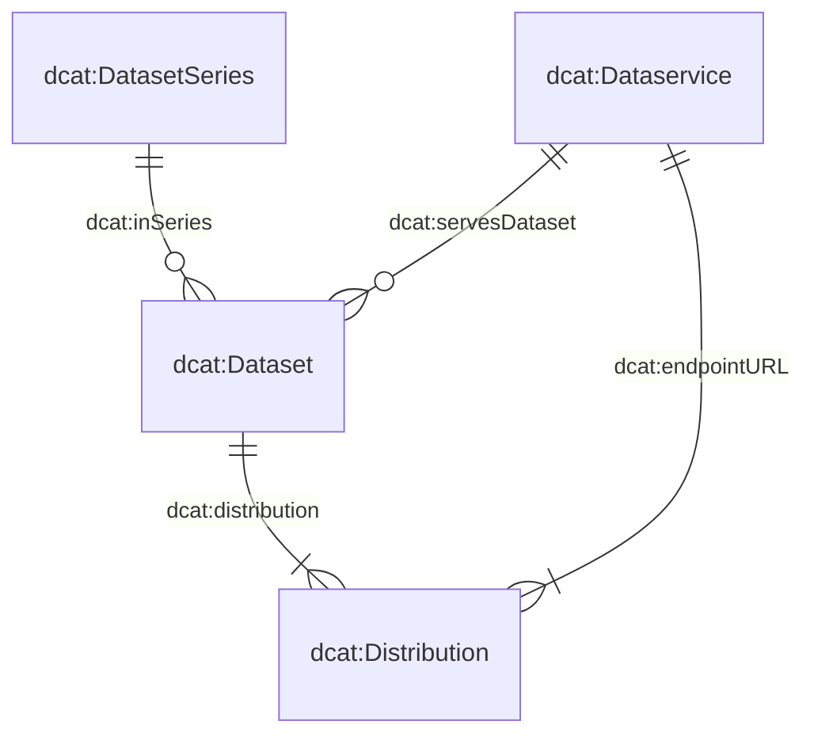

# Come contribuire?
Si prega di aprire una segnalazione (issue) se si hanno requisiti che il catalogo dati dovrebbe soddisfare. In alternativa, è possibile contattarci via e-mail.

# Il modello dei metadati

Il modello dei metadati che sottende il nostro sistema è composto da quattro classi principali: `dcat:Dataset`, `dcat:DatasetSeries`, `dcat:Distribution` e `dcat:DataService`.  
Il diagramma sottostante illustra le relazioni tra queste classi:



Molte delle classi e dei loro attributi sono stati direttamente derivati dallo Swiss DCAT Application Profile (DCAT-AP CH), come descritto in dettaglio su [DCAT-AP CH](https://www.dcat-ap.ch/).  
Per soddisfare al meglio le nostre esigenze specifiche, abbiamo arricchito queste classi con attributi aggiuntivi, indicati dal prefisso `bv:`.

In particolare, tre di queste classi — `dcat:Dataset`, `dcat:DatasetSeries` e `dcat:DataService` — sono definite in schemi JSON dedicati. La quarta classe, `dcat:Distribution`, è descritta nello stesso schema di `dcat:Dataset`, il che riflette la relazione stretta 1:n tra dataset e distribuzioni.  
Puoi consultare gli attributi di questi schemi attraverso i seguenti link:

- [`dcat:Dataset` (with `dcat:Distribution`)](https://json-schema.app/view/%23?url=https%3A%2F%2Fraw.githubusercontent.com%2Fblw-ofag-ufag%2Fmetadata%2Frefs%2Fheads%2Fmain%2Fdata%2Fschemas%2Fdataset.json)
- [`dcat:DatasetSeries`](https://json-schema.app/view/%23?url=https%3A%2F%2Fraw.githubusercontent.com%2Fblw-ofag-ufag%2Fmetadata%2Frefs%2Fheads%2Fmain%2Fdata%2Fschemas%2FdatasetSeries.json)
- [`dcat:DataService`](https://json-schema.app/view/%23?url=https%3A%2F%2Fraw.githubusercontent.com%2Fblw-ofag-ufag%2Fmetadata%2Frefs%2Fheads%2Fmain%2Fdata%2Fschemas%2FdataService.json)

Si noti che queste pagine sono generate automaticamente a partire dai reali schemi JSON memorizzati [qui](https://github.com/blw-ofag-ufag/metadata/tree/main/data/schemas).

# Attributi
```

    "adms:status": "Stato del prodotto dati: se è in fase di elaborazione, se è completato, ecc.",
    "bv:abrogation": "Qual è la data di abrogazione?",
    "bv:archivalValue": "Il prodotto di dati ha un'utilità o un significato duraturo che ne giustifica l'ulteriore conservazione a causa delle informazioni amministrative, legali, fiscali, probatorie o storiche in esso contenute?",
    "bv:classification": "Qual è la classificazione della collezione di dati secondo la legge sulla sicurezza delle informazioni (cfr. art. 13 LSIn)?",
    "bv:externalCatalogs": "Il prodotto dati deve essere pubblicato su altre piattaforme come i14y e/o opendata.swiss?",
    "bv:geoIdentifier": "Qual è il geoidentificatore corrispondente secondo l'Ordinanza sulla geoinformazione, allegato 1?",
    "bv:itSystem": "In quale sistema IT viene utilizzato il vostro prodotto dati? Si prega di indicare un URL.",
    "bv:personalData": "Qual è la classificazione della collezione di dati secondo la legge sulla protezione dei dati (cfr. art. 5 LPD)?",
    "bv:retentionPeriod": "Per quanto tempo deve essere conservato il vostro prodotto di dati?",
    "bv:typeOfData": "Quale tipo descrive meglio il tuo prodotto dati?",
    "dcat:accessService": "Un servizio dati consente l'accesso alla diffusione del prodotto dati.",
    "bv:dimensions": "Le dimensioni descrivono la struttura della distribuzione – le colonne/i concetti che contiene – utilizzando chiavi dal glossario delle dimensioni.",
    "dcat:accessURL": "L'URL tramite il quale si accede alla risorsa (ad es. una landing page o un modulo web). L'URL indicato deve contenere informazioni sul protocollo utilizzato, ovvero https:// o http://.",
    "dcat:contactPoint": "A chi può rivolgersi l'utente dei dati se ha domande o commenti sul contenuto del prodotto di dati? Si prega di fornire i dati di contatto di un'organizzazione.",
    "dcat:distribution": "Un'istanza del prodotto dati che può essere visualizzata o utilizzata. Ad esempio, una tabella con informazioni identiche può essere fornita come file Excel, CSV o JSON. I tre file sono distribuzioni dello stesso prodotto dati.",
    "dcat:downloadURL": "Dove è possibile accedere al prodotto dati?",
    "dcat:inSeries": "Il vostro prodotto di dati fa parte di una serie di dati? Quale?",
    "dcat:keyword": "Quali parole chiave sono utili per trovare il tuo prodotto dati? È più facile trovare il tuo prodotto dati se inserisci più parole chiave che compaiono anche nei prodotti dati dei tuoi colleghi. ",
    "dcat:landingPage": "Dove possono trovare gli utenti dei dati ulteriori informazioni sul vostro prodotto o sull'organizzazione responsabile?",
    "dcat:theme": "Tema utilizzato per classificare i prodotti di dati nel catalogo.",
    "dcat:version": "Di quale versione si tratta? Si prega di utilizzare numeri di versione semantici nella forma X.Y.Z, dove un aumento di X indica modifiche significative, Y indica modifiche minori e Z indica semplici correzioni come errori di battitura.",
    "dcatap:applicableLegislation": "Questa caratteristica si riferisce alla base giuridica del prodotto di dati.",
    "dcatap:availability": "La disponibilità del vostro prodotto di dati è temporanea, stabile o sperimentale?",
    "dct:accessRights": "Informazioni relative alla natura aperta dei dati contenuti nel prodotto, all'esistenza di restrizioni di accesso o alla loro natura non pubblica.",
    "dct:accrualPeriodicity": "Frequenza con cui viene aggiornato il prodotto dati.",
    "dct:conformsTo": "Il vostro prodotto dati è conforme a determinati standard e/o specifiche?",
    "dct:description": "Si prega di fornire una descrizione affinché l'utente dei dati possa comprendere il contenuto del prodotto, chi è un potenziale utente e a cosa serve il prodotto.",
    "dct:format": "Qual è il formato dei file di questa distribuzione?",
    "dct:issued": "Quando è stato pubblicato originariamente il prodotto di dati?",
    "dct:license": "Con quale licenza è possibile utilizzare il prodotto dati?",
    "dct:modified": "Quando è stata effettuata l'ultima modifica al prodotto dati?",
    "dct:publisher": "Chi è l'organizzazione che pubblica il prodotto di dati?",
    "dct:replaces": "Quale prodotto di dati viene sostituito?",
    "dct:spatial": "Qual è l'area geografica coperta dal prodotto di dati?",
    "dct:temporal": "Qual è il periodo di tempo coperto dal vostro prodotto dati?",
    "dct:title": "Titolo del vostro prodotto dati",
    "foaf:page": "Esistono documentazioni o siti web che descrivono più dettagliatamente questo prodotto di dati?",
    "prov:qualifiedAttribution": "Chi ha quale ruolo per questo prodotto di dati?",
    "prov:wasDerivedFrom": "Da quale altro prodotto di dati è stato derivato questo prodotto di dati?",
    "prov:wasGeneratedBy": "Da quale processo aziendale è stato generato questo prodotto di dati?",
    "schema:comment": "Esistono ulteriori informazioni rilevanti su questo prodotto di dati?"

```

# Linee guida per i tag

I tag svolgono diverse funzioni nel nostro catalogo di dati.
Aiutano voi, i vostri colleghi e gli utenti esterni a scoprire e organizzare rapidamente i dataset e a identificare quali temi o argomenti ciascun dataset copre.
Scegliendo tag coerenti e pertinenti, vi assicurate che voi stessi e altri utenti possiate trovare e riutilizzare i dati con maggiore facilità.
Gli utenti possono individuare i vostri dati cercando un tag che hanno già incontrato in un altro dataset.

Se mancano parole chiave importanti, vi preghiamo di aprire una segnalazione o di inviarci un'e-mail.

