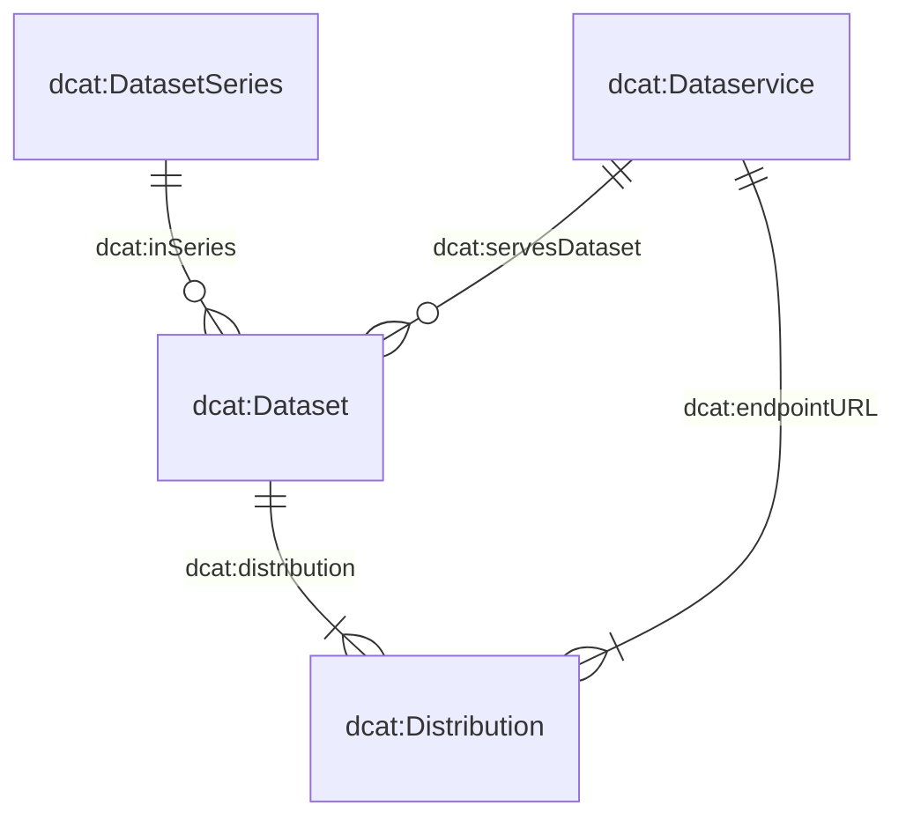

# Das Metadatenmodell

Das Metadatenmodell, das unserem System zugrunde liegt, besteht aus vier zentralen Klassen: `dcat:Dataset`, `dcat:DatasetSeries`, `dcat:Distribution` und `dcat:DataService`. 
Das untenstehende Diagramm veranschaulicht die Beziehungen zwischen diesen Klassen:

Viele der Klassen und deren Attribute wurden direkt aus dem Swiss DCAT Application Profile (DCAT-AP CH) übernommen, wie auf [DCAT-AP CH](https://www.dcat-ap.ch/) detailliert beschrieben.
Um unseren spezifischen Anforderungen besser gerecht zu werden, haben wir diese Klassen durch zusätzliche Attribute erweitert, die mit dem Präfix `bv:` gekennzeichnet sind.

Insbesondere sind drei dieser Klassen — `dcat:Dataset`, `dcat:DatasetSeries` und `dcat:DataService` — in eigenen JSON-Schemata definiert. Die vierte Klasse, `dcat:Distribution`, wird im gleichen Schema wie `dcat:Dataset` beschrieben, was die strikte 1:n-Beziehung zwischen Datensätzen und Distributionen widerspiegelt.
Die Attribute dieser Schemata können Sie über die folgenden Links einsehen:

- [`dcat:Dataset` (with `dcat:Distribution`)](https://json-schema.app/view/%23?url=https%3A%2F%2Fraw.githubusercontent.com%2Fblw-ofag-ufag%2Fmetadata%2Frefs%2Fheads%2Fmain%2Fdata%2Fschemas%2Fdataset.json)
- [`dcat:DatasetSeries`)](https://json-schema.app/view/%23?url=https%3A%2F%2Fraw.githubusercontent.com%2Fblw-ofag-ufag%2Fmetadata%2Frefs%2Fheads%2Fmain%2Fdata%2Fschemas%2FdatasetSeries.json)
- [`dcat:Dataset`)](https://json-schema.app/view/%23?url=https%3A%2F%2Fraw.githubusercontent.com%2Fblw-ofag-ufag%2Fmetadata%2Frefs%2Fheads%2Fmain%2Fdata%2Fschemas%2FdataService.json)

Bitte beachten Sie, dass diese Seiten automatisch aus den tatsächlichen JSON-Schemata generiert werden, die [hier](https://github.com/blw-ofag-ufag/metadata/tree/main/data/schemas) gespeichert sind.

# Tagging-Richtlinien

Tags erfüllen mehrere Zwecke in unserem Datenkatalog.
Sie helfen Ihnen, Ihren Kolleginnen und Kollegen sowie externen Nutzenden, Datensätze rasch zu finden, zu organisieren und anzuzeigen, welche Themen oder Sachgebiete ein Datensatz abdeckt.
Durch die Wahl von guten, konsistenten Tags gewährleisten Sie, dass sowohl Sie als auch andere die Daten leichter finden und wiederverwenden können.
Andere können Ihre Daten entdecken, indem sie nach einem Tag suchen, den sie möglicherweise bereits bei einem anderen Datensatz gesehen haben.

Um die universelle Verwendbarkeit und Standardisierung zu maximieren, empfehlen wir dringend, Tags auf Englisch zu verwenden.
Dieser Ansatz erweitert den Nutzerkreis, der Ihre Datensätze verstehen und durchsuchen kann.

Wenn Sie Tags zur Eigenschaft `dcat:keyword` hinzufügen, achten Sie darauf, dass diese prägnant und aussagekräftig sind.
Einzelne Wörter wie beispielsweise `"milk"` oder `"software"` eignen sich oft am besten, aber kurze mehrgliedrige Begriffe wie `time-series` oder `"market-data"` können ebenfalls hilfreich sein.
Wenn Sie mehrere Wörter kombinieren, verbinden Sie diese mit Bindestrichen (`-`) und vermeiden Sie Leerzeichen (z. B. `"something like this"`) oder CamelCase (z. B. `"tryNotToDoThis"`).
In der Regel sollten Tags kleingeschrieben sein, es sei denn, es handelt sich um anerkannte Abkürzungen oder Markennamen (z. B. `"GIS"`, `"FOAG"`, `"digiFLUX"`, `"DigiAgriFoodCH"` oder `"eCH-0261"`).

Vermeiden Sie es, einen einzelnen Tag mit zu vielen Konzepten zu überladen.
Wenn ein potentieller Tag sehr lang ist oder mehrere Themen abdeckt, teilen Sie ihn in einzelne, klarere und präzisere Tags auf.
Schliesslich gilt, dass es keine feste Obergrenze für die Anzahl an Tags gibt – achten Sie jedoch darauf, dass jeder Tag relevant für den Datensatz ist.

Hier sind einige zulässige Beispiele für Tags:

- `"milk"`
- `"animal-production"`
- `"time-series"`
- `"linked-data"`
- `"agricultural-report"`
- `"agricultural-policy"`
- `"eCH-0261"`
- `"digiFLUX"`
- `"DigiAgriFoodCH"`

Diese Tags sind kurz, bei Bedarf mit Bindestrichen verbunden und enthalten Grossbuchstaben nur bei anerkannten Abkürzungen oder Markennamen.

Beispiele für Keywords, die Sie vermeiden sollten:

- `"conservation-and-archiving-planning-aap---confederation"`: Dieser Tag ist viel zu lang und kombiniert mehrere Themen. Besser wäre es, diesen Tag in `"conservation"`, `"archivation"` und `"confederation"` aufzuteilen.
- `"Data standard agricultural data"`: Dieser Tag verwendet Leerzeichen statt Bindestriche, ist zu lang und beginnt mit einem Grossbuchstaben. Eine bessere Wahl wäre `"data-standard"`.
- `"fertiliserProductCategory"`: Dieser Tag verwendet CamelCase anstelle von Bindestrichen. Eine bessere Wahl wäre, ihn in `"fertilizer"` und `"product-category"` aufzuteilen.

Indem Sie diese Richtlinien beachten, helfen Sie, unseren Katalog übersichtlich und benutzerfreundlich zu halten. Dadurch wird es einfacher für alle, Ihre Daten zu finden, zu verstehen und wiederzuverwenden.