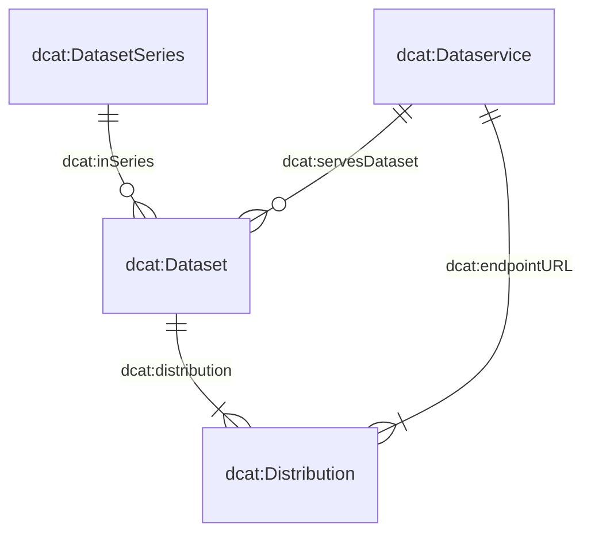

# Le modèle de métadonnées

Le modèle de métadonnées qui sous-tend notre système se compose de quatre classes principales : `dcat:Dataset`, `dcat:DatasetSeries`, `dcat:Distribution` et `dcat:DataService`.
Le diagramme ci-dessous illustre les relations entre ces classes:

De nombreuses classes et leurs attributs ont été directement dérivés du Swiss DCAT Application Profile (DCAT-AP CH), tel que détaillé sur [DCAT-AP CH](https://www.dcat-ap.ch/).
Afin de mieux répondre à nos exigences spécifiques, nous avons enrichi ces classes avec des attributs supplémentaires, indiqués par le préfixe `bv:`.

En particulier, trois de ces classes — `dcat:Dataset`, `dcat:DatasetSeries` et `dcat:DataService` — sont définies dans des schémas JSON dédiés.
La quatrième classe, `dcat:Distribution`, est décrite dans le même schéma que `dcat:Dataset`, ce qui reflète la relation stricte 1:n entre les ensembles de données et les distributions.
Vous pouvez consulter les attributs de ces schémas via les liens suivants :

- [`dcat:Dataset` (with `dcat:Distribution`)](https://json-schema.app/view/%23?url=https%3A%2F%2Fraw.githubusercontent.com%2Fblw-ofag-ufag%2Fmetadata%2Frefs%2Fheads%2Fmain%2Fdata%2Fschemas%2Fdataset.json)
- [`dcat:DatasetSeries`](https://json-schema.app/view/%23?url=https%3A%2F%2Fraw.githubusercontent.com%2Fblw-ofag-ufag%2Fmetadata%2Frefs%2Fheads%2Fmain%2Fdata%2Fschemas%2FdatasetSeries.json)
- [`dcat:DataService`](https://json-schema.app/view/%23?url=https%3A%2F%2Fraw.githubusercontent.com%2Fblw-ofag-ufag%2Fmetadata%2Frefs%2Fheads%2Fmain%2Fdata%2Fschemas%2FdataService.json)

Veuillez noter que ces pages sont générées automatiquement à partir des schémas JSON réels stockés [ici](https://github.com/blw-ofag-ufag/metadata/tree/main/data/schemas).

# Directives pour les tags

Les tags servent plusieurs objectifs dans notre catalogue de données.
Ils aident vous-même, vos collègues et les utilisateurs externes à rapidement trouver et organiser des jeux de données, ainsi qu’à identifier les thèmes ou sujets qu'un jeu de données couvre.
En choisissant des tags pertinents et cohérents, vous permettez à chacun, y compris vous-même, de trouver et réutiliser plus facilement les données.
Les utilisateurs peuvent découvrir vos données en recherchant un tag qu'ils auraient vu sur un autre jeu de données.

Afin de maximiser l'universalité et la standardisation, nous recommandons fortement l’utilisation de l’anglais pour les tags.
Cette approche élargit l’audience pouvant comprendre et rechercher vos jeux de données.

Lorsque vous ajoutez des tags sous la propriété `dcat:keyword`, veillez à ce qu’ils soient concis et descriptifs.
Des mots uniques comme `"milk"` ou `"software"` conviennent souvent très bien, mais de courtes expressions de plusieurs mots comme `time-series` ou `"market-data"` peuvent également être utiles.
Si vous combinez plusieurs mots, reliez-les par des tirets (`-`) plutôt que par des espaces (par exemple `"something like this"`) ou en CamelCase (par exemple `"tryNotToDoThis"`).
En général, les tags doivent être écrits en minuscules, sauf lorsqu'il s'agit d'abréviations reconnues ou de noms de marques (par exemple, `"GIS"`, `"FOAG"`, `"digiFLUX"`, `"DigiAgriFoodCH"` ou `"eCH-0261"`).

Évitez de surcharger un tag unique avec trop de concepts.
Si un tag potentiel est très long ou couvre plusieurs sujets, divisez-le en plusieurs tags plus clairs et précis.
Enfin, il n’y a pas de limite stricte quant au nombre de tags que vous pouvez inclure — assurez-vous simplement que chacun est pertinent pour le jeu de données.

Voici quelques exemples autorisés pour les tags :

- `"milk"`
- `"animal-production"`
- `"time-series"`
- `"linked-data"`
- `"agricultural-report"`
- `"agricultural-policy"`
- `"eCH-0261"`
- `"digiFLUX"`
- `"DigiAgriFoodCH"`

Ces tags sont courts, connectés avec des tirets lorsque nécessaire, et ne comportent des majuscules que pour les abréviations ou marques reconnues.

Voici des exemples de mots-clés à éviter :

- `"conservation-and-archiving-planning-aap---confederation"` : ce tag est beaucoup trop long et mélange plusieurs idées. Il serait préférable de le séparer en `"conservation"`, `"archivation"` et `"confederation"`.
- `"Data standard agricultural data"` : ce tag utilise des espaces au lieu de tirets, est trop long et commence par une majuscule. Un meilleur choix serait `"data-standard"`.
- `"fertiliserProductCategory"` : ce tag utilise du CamelCase au lieu de tirets. Un meilleur choix serait de le diviser en `"fertilizer"` et `"product-category"`.

En suivant ces directives, vous contribuerez à maintenir notre catalogue organisé et convivial, facilitant ainsi la recherche, la compréhension et la réutilisation des données par tous.
