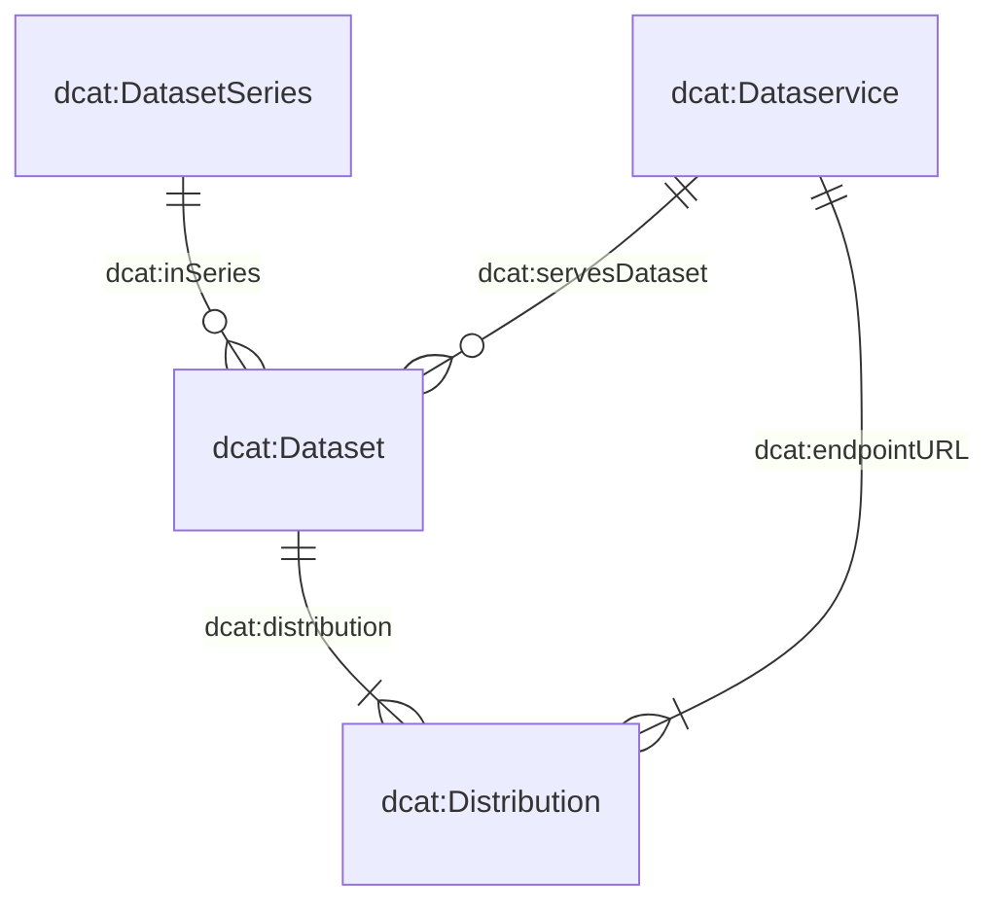

# Il modello dei metadati

Il modello dei metadati che sottende il nostro sistema è composto da quattro classi principali: `dcat:Dataset`, `dcat:DatasetSeries`, `dcat:Distribution` e `dcat:DataService`.  
Il diagramma sottostante illustra le relazioni tra queste classi:

Molte delle classi e dei loro attributi sono stati direttamente derivati dallo Swiss DCAT Application Profile (DCAT-AP CH), come descritto in dettaglio su [DCAT-AP CH](https://www.dcat-ap.ch/).  
Per soddisfare al meglio le nostre esigenze specifiche, abbiamo arricchito queste classi con attributi aggiuntivi, indicati dal prefisso `bv:`.

In particolare, tre di queste classi — `dcat:Dataset`, `dcat:DatasetSeries` e `dcat:DataService` — sono definite in schemi JSON dedicati. La quarta classe, `dcat:Distribution`, è descritta nello stesso schema di `dcat:Dataset`, il che riflette la relazione stretta 1:n tra dataset e distribuzioni.  
Puoi consultare gli attributi di questi schemi attraverso i seguenti link:

- [`dcat:Dataset` (with `dcat:Distribution`)](https://json-schema.app/view/%23?url=https%3A%2F%2Fraw.githubusercontent.com%2Fblw-ofag-ufag%2Fmetadata%2Frefs%2Fheads%2Fmain%2Fdata%2Fschemas%2Fdataset.json)
- [`dcat:DatasetSeries`](https://json-schema.app/view/%23?url=https%3A%2F%2Fraw.githubusercontent.com%2Fblw-ofag-ufag%2Fmetadata%2Frefs%2Fheads%2Fmain%2Fdata%2Fschemas%2FdatasetSeries.json)
- [`dcat:DataService`](https://json-schema.app/view/%23?url=https%3A%2F%2Fraw.githubusercontent.com%2Fblw-ofag-ufag%2Fmetadata%2Frefs%2Fheads%2Fmain%2Fdata%2Fschemas%2FdataService.json)

Si noti che queste pagine sono generate automaticamente a partire dai reali schemi JSON memorizzati [qui](https://github.com/blw-ofag-ufag/metadata/tree/main/data/schemas).

# Linee guida per i tag

I tag svolgono diverse funzioni nel nostro catalogo di dati.
Aiutano voi, i vostri colleghi e gli utenti esterni a scoprire e organizzare rapidamente i dataset e a identificare quali temi o argomenti ciascun dataset copre.
Scegliendo tag coerenti e pertinenti, vi assicurate che voi stessi e altri utenti possiate trovare e riutilizzare i dati con maggiore facilità.
Gli utenti possono individuare i vostri dati cercando un tag che hanno già incontrato in un altro dataset.

Per mantenere il più possibile l’universalità e la standardizzazione, raccomandiamo fortemente di utilizzare l’inglese per i tag.
Questo approccio amplia il numero di utenti che possono comprendere e cercare i vostri dataset.

Quando aggiungete i tag sotto la proprietà `dcat:keyword`, concentratevi su termini concisi e descrittivi.
Singole parole come `"milk"` o `"software"` spesso funzionano meglio, ma anche brevi espressioni composte da più parole come `time-series` o `"market-data"` possono essere utili.
Se dovete combinare più parole, unitele con trattini (`-`) invece che spazi (ad esempio, `"something like this"`) o CamelCase (ad esempio, `"tryNotToDoThis"`).
Generalmente i tag dovrebbero essere scritti in minuscolo, a meno che non si tratti di abbreviazioni riconosciute o marchi (ad esempio, `"GIS"`, `"FOAG"`, `"digiFLUX"`, `"DigiAgriFoodCH"` o `"eCH-0261"`).

Evitate di sovraccaricare un singolo tag con troppi concetti.
Se vi accorgete che un potenziale tag è molto lungo o copre più argomenti, suddividetelo in tag separati più chiari e precisi.
Infine, ricordate che non c’è un limite rigido al numero di tag che potete inserire; assicuratevi semplicemente che ciascuno sia pertinente al dataset.

Ecco alcuni esempi consentiti di tag:

- `"milk"`
- `"animal-production"`
- `"time-series"`
- `"linked-data"`
- `"agricultural-report"`
- `"agricultural-policy"`
- `"eCH-0261"`
- `"digiFLUX"`
- `"DigiAgriFoodCH"`

Questi tag sono brevi, connessi con trattini se necessario e contengono lettere maiuscole solo in caso di abbreviazioni riconosciute o marchi.

Ecco esempi di parole chiave da evitare:

- `"conservation-and-archiving-planning-aap---confederation"`: questo tag è troppo lungo e combina diversi concetti. Sarebbe meglio suddividerlo in `"conservation"`, `"archivation"` e `"confederation"`.
- `"Data standard agricultural data"`: questo tag usa spazi invece di trattini, è troppo lungo e inizia con la lettera maiuscola. Una scelta migliore sarebbe `"data-standard"`.
- `"fertiliserProductCategory"`: questo tag usa CamelCase invece di trattini. È preferibile suddividerlo in `"fertilizer"` e `"product-category"`.

Seguendo queste linee guida, contribuirete a mantenere il nostro catalogo organizzato e semplice da utilizzare, facilitando così per tutti il ritrovamento, la comprensione e il riutilizzo dei dati.
