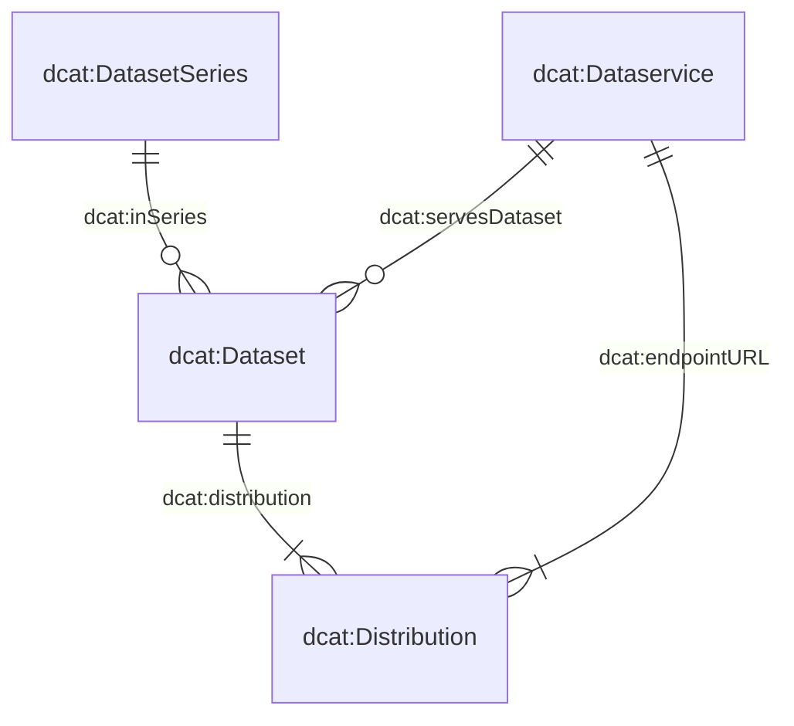

# The metadata model

The metadata model underpinning our system is comprised of four core classes: `dcat:Dataset`, `dcat:DatasetSeries`, `dcat:Distribution`, and `dcat:DataService`. The diagram below illustrates the relationships among these classes:

Many of the classes and their attributes are directly derived from the Swiss DCAT Application Profile (DCAT-AP CH), as detailed on [DCAT-AP CH](https://www.dcat-ap.ch/). To better accommodate our specific requirements, we have further augmented these classes with additional attributes, denoted by the prefix `bv:`.

In particular, three of these classes — `dcat:Dataset`, `dcat:DatasetSeries`, and `dcat:DataService` — are defined in dedicated JSON schemas. The fourth class, `dcat:Distribution`, is described within the same schema as `dcat:Dataset`, reflecting the strict 1:n relationship between datasets and distributions. You can explore the attributes of these schemas via the following links:

- [`dcat:Dataset` (with `dcat:Distribution`)](https://json-schema.app/view/%23?url=https%3A%2F%2Fraw.githubusercontent.com%2Fblw-ofag-ufag%2Fmetadata%2Frefs%2Fheads%2Fmain%2Fdata%2Fschemas%2Fdataset.json)
- [`dcat:DatasetSeries`](https://json-schema.app/view/%23?url=https%3A%2F%2Fraw.githubusercontent.com%2Fblw-ofag-ufag%2Fmetadata%2Frefs%2Fheads%2Fmain%2Fdata%2Fschemas%2FdatasetSeries.json)
- [`dcat:Dataset`](https://json-schema.app/view/%23?url=https%3A%2F%2Fraw.githubusercontent.com%2Fblw-ofag-ufag%2Fmetadata%2Frefs%2Fheads%2Fmain%2Fdata%2Fschemas%2FdataService.json)

Please note that these pages are automatically generated from the actual JSON schemas stored [here](https://github.com/blw-ofag-ufag/metadata/tree/main/data/schemas).

# Tagging guidelines

Tags serve multiple purposes in our data catalog.
They help you, your colleagues, and external users quickly discover and organize datasets, as well as indicate which themes or topics a dataset covers.
By selecting good, consistent tags, you ensure that both you and others can locate and reuse the data more easily.
They can find your data by searching for a tag they may have found under another data set (with the same tag).

To keep things as universal and standard as possible, we strongly encourage using English for tags.
This approach broadens the audience that can understand and search for your datasets.

When adding tags under the `dcat:keyword` property, focus on making them concise and descriptive.
Single words such as `"milk"` or `"software"` often work best, but short multiword phrases like `time-series` or `"market-data"` can also be helpful.
If you’re combining multiple words, connect them with hyphens (`-`) rather than spaces (e.g. `"something like this"`) or CamelCase (e.g. `"tryNotToDoThis"`).
Typically, tags should be lowercase, unless you’re dealing with recognized abbreviations or brand names (e.g., `"GIS"`, `"FOAG"`, `"digiFLUX"`, `"DigiAgriFoodCH"` or `"eCH-0261"`).

Try to avoid overloading a single tag with too many concepts.
If you find a potential tag is very long or covers multiple topics, break it down into separate tags that are clearer and more precise.
Finally, remember there is no hard limit on how many tags you may include — just ensure each is relevant to the dataset.

Here are a few allowed examples for tags:

- `"milk"`
- `"animal-production"`
- `"time-series"`
- `"linked-data"`
- `"agricultural-report"`
- `"agricultural-policy"`
- `"eCH-0261"`
- `"digiFLUX"`
- `"DigiAgriFoodCH"`

These are all short, connected with hyphens when needed, and capitalize only recognized abbreviations or brand names.

Here are examples of keywords that you should avoid using:

- `"conservation-and-archiving-planning-aap---confederation"`: this is far too long and lumps multiple ideas into one tag. A better choice would be splitting the tag into `"conservation"`, `"archivation"` and `"confederation"`.
- `"Data standard agricultural data"`: this uses spaces instead of hyphens, is too long and capitalizes first word. A better choice would be `"data-standard"`.
- `"fertiliserProductCategory"`: this keyword uses camel case instead of hyphens. A better choice would be splitting the tag into `"fertilizer"` and `"product-category"`.

By following these guidelines, you’ll help keep our catalog organized and user-friendly, making it easier for everyone to find, understand, and reuse your data.