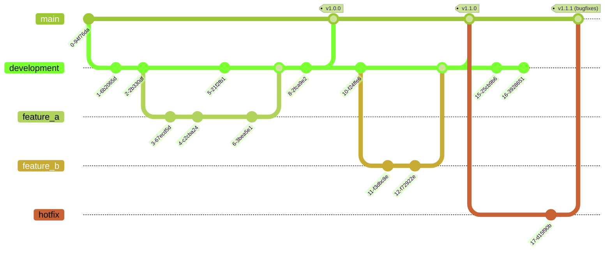

# Some h1 header

## And some h2 header

Lets' test how well this works with the markdown integration...


We can list a bunch of stuff:

- Item A
- Item B
- **Bold Item C**

And of course, we can use code chunks:

```json
{
    "name": "Alex",
    "age": 31
}
```

# Mermaid Diagram Example

This is an example of a Mermaid diagram rendered from Markdown:

